# 📊 부기맨(Boogieman) 전체 ERD (Entity Relationship Diagram)

---

## Mermaid ERD 다이어그램

```mermaid
erDiagram

    USERS {
        BIGINT          user_id             PK "사용자 ID"
        VARCHAR(255)    email                  "사용자 이메일 (UNIQUE, NOT NULL)"
        VARCHAR(255)    password               "비밀번호"
        VARCHAR(50)     name                   "사용자 이름 (NOT NULL)"
        BIGINT          department_id          "부서 ID (FK)"
        VARCHAR(500)    profile_image          "프로필 이미지 URL"
        VARCHAR(20)     role                   "권한 (NOT NULL) - ROLE_USER, ROLE_ADMIN"
        INT             login_fail_count       "로그인 실패 횟수"
        BOOLEAN         is_locked              "계정 잠금 여부"
        DATETIME        restriction_until      "연체 대출 제한 종료일 (overdue_record 캐시 — NULL이면 제한 없음)"
        BOOLEAN         is_deleted             "소프트 삭제 플래그"
        DATETIME        created_at             "생성일시"
        DATETIME        updated_at             "수정일시"
    }

    DEPARTMENT {
        BIGINT      department_id   PK  "부서 ID"
        VARCHAR(50) name                "부서명"
        BOOLEAN     is_deleted          "소프트 삭제 플래그"
        DATETIME    created_at          "생성일시"
        DATETIME    updated_at          "수정일시"
    }

    BOOK {
        BIGINT       book_id              PK  "도서 내부 식별 ID"
        VARCHAR(13)  isbn13               UK  "ISBN13 (숫자 13자리, 하이픈 제거) NOT NULL"
        VARCHAR(10)  isbn10                   "ISBN10"
        VARCHAR(512) title                    "도서 제목 NOT NULL"
        VARCHAR(512) author                   "저자/아티스트 정보 NOT NULL"
        VARCHAR(255) publisher                "출판사 NOT NULL"
        DATE         pub_date                 "출간일"
        TEXT         description              "상품 설명 (요약)"
        VARCHAR(1024) cover_url              "표지 이미지 URL (cover500 규격 권장)"
        INT          category_id              "알라딘 분야 ID"
        VARCHAR(255) category_name            "분야명"
        INT          price_standard           "정가 DEFAULT 0"
        INT          price_sales              "판매가 DEFAULT 0"
        VARCHAR(50)  stock_status             "재고 상태 (품절, 절판 등)"
        INT          customer_review_rank     "회원 리뷰 평점 (0~10) DEFAULT 0"
        INT          series_id                "시리즈 ID"
        VARCHAR(255) series_name              "시리즈 이름"
        VARCHAR(20)  mall_type                "상품 타입 (BOOK, MUSIC 등) DEFAULT BOOK"
        CHAR(1)      adult_yn                 "성인 등급 여부 (Y/N) DEFAULT N"
        BOOLEAN      is_deleted               "소프트 삭제 플래그"
        DATETIME     created_at               "생성일시"
        DATETIME     updated_at               "수정일시"
    }

    BOOK_HOLD {
        BIGINT      book_hold_id    PK  "도서 보유 ID (실물 1권 단위)"
        BIGINT      book_id         FK  "도서 ID (NOT NULL)"
        VARCHAR(50) status              "보유 상태 (NOT NULL): AVAILABLE, BORROWED, RESERVE_HOLD, LOST, DISCARDED"
        VARCHAR(50) location            "위치 (도서관 구역 등)"
        BOOLEAN     is_deleted          "소프트 삭제 플래그"
        DATETIME    created_at          "생성일시"
        DATETIME    updated_at          "수정일시"
    }

    BOOK_BORROW {
        BIGINT          book_borrow_id  PK  "대출 ID"
        BIGINT          book_hold_id    FK  "도서 보유 ID (NOT NULL)"
        BIGINT          user_id         FK  "사용자 ID (NOT NULL)"
        VARCHAR(512)    reason              "대출 사유"
        VARCHAR(50)     status              "대출 상태 (NOT NULL): ACTIVE, RETURNED, OVERDUE"
        DATETIME        borrow_date         "대출일시 (NOT NULL)"
        DATETIME        due_date            "반납예정일 (NOT NULL)"
        DATETIME        return_date         "반납일시"
        INT             extend_count        "연장 횟수 (최대 1회)"
        BOOLEAN         is_deleted          "소프트 삭제 플래그"
        DATETIME        created_at          "생성일시"
        DATETIME        updated_at          "수정일시"
    }

    RESERVATION {
        BIGINT      reservation_id  PK  "예약 ID"
        BIGINT      book_id         FK  "도서 ID (NOT NULL) - 도서 단위 예약"
        BIGINT      user_id         FK  "사용자 ID (NOT NULL)"
        INT         reservation_order   "예약 순서 (1, 2)"
        VARCHAR(50) status              "예약 상태 (NOT NULL): WAITING, NOTIFIED, RESERVED, EXPIRED, CANCELLED"
        DATETIME    reserved_at         "예약일시"
        DATETIME    notified_at         "알림 전송일시"
        DATETIME    expire_at           "예약만료일시"
        BOOLEAN     is_deleted          "소프트 삭제 플래그"
        DATETIME    created_at          "생성일시"
        DATETIME    updated_at          "수정일시"
    }

    BOOK_REQUEST {
        BIGINT       book_request_id     PK  "도서 희망 신청 ID"
        BIGINT       user_id             FK  "사용자 ID (NOT NULL)"
        VARCHAR(512) title                   "신청 도서명"
        VARCHAR(512) author                  "신청 저자"
        VARCHAR(255) publisher               "신청 출판사"
        VARCHAR(13)  isbn13                  "ISBN13"
        VARCHAR(512) reason                  "신청 사유"
        VARCHAR(50)  status                  "신청 상태: PENDING, APPROVED, REJECTED, ARRIVED"
        VARCHAR(512) rejection_reason        "거절 사유"
        BOOLEAN      is_deleted              "소프트 삭제 플래그"
        DATETIME     created_at              "생성일시"
        DATETIME     updated_at              "수정일시"
    }

    NOTIFICATION {
        BIGINT      notification_id         PK  "알림 ID"
        BIGINT      user_id                 FK  "사용자 ID (NOT NULL)"
        VARCHAR(50) type                        "알림 타입: BOOK_REQUEST_APPROVED, BOOK_REQUEST_REJECTED, BOOK_REQUEST_ARRIVED, RESERVATION_ARRIVED, RETURN_DUE_SOON, OVERDUE_NOTICE"
        VARCHAR(255) title                      "알림 제목"
        TEXT        message                     "알림 내용"
        BIGINT      related_book_id             "관련 도서 ID (선택)"
        BIGINT      related_borrow_id           "관련 대출 ID (선택)"
        BIGINT      related_reservation_id      "관련 예약 ID (선택)"
        BIGINT      related_book_request_id     "관련 희망도서 신청 ID (선택)"
        BOOLEAN     is_read                     "읽음 여부"
        DATETIME    read_at                     "읽음 일시"
        DATETIME    created_at                  "생성일시"
        DATETIME    updated_at                  "수정일시"
    }

    POLICY {
        BIGINT       policy_id       PK  "정책 ID"
        VARCHAR(50)  type                "정책 유형: BORROW_LIMIT, BORROW_PERIOD, OVERDUE_PENALTY, RESERVATION_LIMIT, RESERVATION_HOLD_PERIOD"
        VARCHAR(255) name                "정책명"
        VARCHAR(512) value               "정책 값 (숫자/문자)"
        VARCHAR(512) description         "정책 설명"
        DATETIME     created_at          "생성일시"
        DATETIME     updated_at          "수정일시"
    }

    OVERDUE_RECORD {
        BIGINT      overdue_record_id   PK  "연체 기록 ID"
        BIGINT      user_id             FK  "사용자 ID (NOT NULL)"
        BIGINT      book_borrow_id      FK  "대출 ID (NOT NULL)"
        INT         overdue_days            "연체 일수"
        INT         restriction_days        "대출 제한 일수"
        DATETIME    restriction_until       "제한 종료일"
        BOOLEAN     is_deleted              "소프트 삭제 플래그 (감사 데이터 보호 — 삭제 시 대출 제한 우회 방지)"
        DATETIME    created_at              "생성일시"
        DATETIME    updated_at              "수정일시"
    }

    %% 관계(논리적 FK)
    DEPARTMENT ||--o{ USERS : "소속"
    USERS ||--o{ BOOK_REQUEST : "희망 도서 신청"
    USERS ||--o{ BOOK_BORROW : "대출 신청"
    USERS ||--o{ RESERVATION : "예약 신청"
    USERS ||--o{ NOTIFICATION : "수신"
    USERS ||--o{ OVERDUE_RECORD : "연체 기록"

    BOOK ||--o{ BOOK_HOLD : "보유 도서 대상"
    BOOK ||--o{ RESERVATION : "예약 대상"
    BOOK_HOLD ||--o{ BOOK_BORROW : "대출 도서 대상"

    BOOK_BORROW ||--o{ OVERDUE_RECORD : "연체 기록 대상"
    BOOK_BORROW ||--o{ NOTIFICATION : "알림 연계"
    RESERVATION ||--o{ NOTIFICATION : "알림 연계"
    BOOK_REQUEST ||--o{ NOTIFICATION : "알림 연계"

    POLICY ||--o{ BOOK_BORROW : "대출 정책 적용"
    POLICY ||--o{ RESERVATION : "예약 정책 적용"
    POLICY ||--o{ OVERDUE_RECORD : "연체 정책 적용"
```



---

## 핵심 엔티티 설명

### USERS (사용자)
- **역할**: 시스템의 모든 사용자 (일반 사용자 + 관리자)
- **주요 필드**:
  - `email`: 회원 식별 기준 (UNIQUE)
  - `role`: ROLE_USER (기본값) 또는 ROLE_ADMIN
  - `login_fail_count`: 5회 이상 실패 시 `is_locked = true`
  - `is_locked`: 계정 잠금 상태 (관리자가 `PATCH /admin/users/{id}/unlock`으로 해제)
  - `restriction_until`: 연체로 인한 대출 제한 종료일 캐시. `overdue_record` 생성 시 동기 갱신. `NULL` 또는 현재 시간 이전이면 대출 가능
- **Soft Delete**: `is_deleted` 플래그로 논리적 삭제

### BOOK (도서)
- **역할**: 시스템에 등록된 도서 (메타데이터)
- **주요 필드**:
  - `isbn13`: 도서 식별 기준 (UNIQUE, 13자리 숫자)
  - `title`, `author`, `publisher`: 기본 정보
  - `cover_url`: 표지 이미지 (알라딘 API에서 `/cover500/` 규격)
  - `category_id`, `category_name`: 알라딘 분야 정보
- **Soft Delete**: `is_deleted` 플래그

### BOOK_HOLD (도서 보유 - 실물 단위)
- **역할**: 도서의 실물 복사본 (1권 = 1 BOOK_HOLD)
- **상태**:
  - `AVAILABLE`: 대출 가능
  - `BORROWED`: 현재 대출 중
  - `RESERVE_HOLD`: 예약 대기 중 (4일 보관)
  - `LOST`: 분실
  - `DISCARDED`: 폐기
- **목적**: 동일 도서의 여러 권을 추적

### BOOK_BORROW (대출 이력)
- **역할**: 사용자의 대출 기록
- **상태**:
  - `ACTIVE`: 현재 대출 중
  - `RETURNED`: 반납 완료
  - `OVERDUE`: 연체 상태 (자동 계산)
- **주요 필드**:
  - `borrow_date`, `due_date`, `return_date`
  - `extend_count`: 연장 횟수 (최대 1회)

### RESERVATION (예약)
- **역할**: 도서 예약 대기열
- **상태**:
  - `WAITING`: 예약 대기 중
  - `NOTIFIED`: 도서 도착 알림 전송됨
  - `RESERVED`: 예약 도서 수령 대기 (RESERVE_HOLD 상태)
  - `EXPIRED`: 4일 경과 후 자동 취소
  - `CANCELLED`: 사용자 취소
- **중요**: 도서 단위 (BOOK_HOLD 아님), 최대 2명까지

### BOOK_REQUEST (희망 도서 신청)
- **역할**: 사용자의 도서 신청 건
- **상태**:
  - `PENDING`: 승인 대기 중
  - `APPROVED`: 관리자 승인 완료 (구매 진행 중)
  - `REJECTED`: 관리자 거절
  - `ARRIVED`: 실물 입고 완료 → Book + BookHold 생성됨
- **목적**: 사내 미보유 도서 구매 신청
- **알림**: 상태 변경 시 신청자에게 `BOOK_REQUEST_APPROVED` / `BOOK_REQUEST_REJECTED` / `BOOK_REQUEST_ARRIVED` 알림 발송

### NOTIFICATION (알림)
- **역할**: 실시간 알림 저장소
- **타입**:
  - `BOOK_REQUEST_APPROVED`: 희망도서 신청 승인 (`related_book_request_id` 참조)
  - `BOOK_REQUEST_REJECTED`: 희망도서 신청 반려 (`related_book_request_id` 참조)
  - `BOOK_REQUEST_ARRIVED`: 희망도서 실물 입고 완료 (`related_book_request_id`, `related_book_id` 참조)
  - `RESERVATION_ARRIVED`: 예약 도서 반납됨 — 수령 가능 (`related_reservation_id`, `related_book_id` 참조)
  - `RETURN_DUE_SOON`: 반납 예정일 1일 전 (`related_borrow_id` 참조)
  - `OVERDUE_NOTICE`: 연체 발생 (`related_borrow_id` 참조)
- **구현**: DB 저장 + Redis Pub/Sub + SSE 실시간 전달

### OVERDUE_RECORD (연체 기록)
- **역할**: 사용자의 연체 패널티 추적
- **주요 필드**:
  - `overdue_days`: 연체 일수
  - `restriction_days`: 대출 제한 기간
  - `restriction_until`: 제한 종료일
- **목적**: 최대 지연일(Max) 기준 대출 정지

### POLICY (정책)
- **역할**: 시스템 운영 정책 설정
- **타입**:
  - `BORROW_LIMIT`: 1인 최대 대출 권수 (기본값: 10)
  - `BORROW_PERIOD`: 기본 대출 기간 (기본값: 14일)
  - `OVERDUE_PENALTY`: 연체 일수 만큼 대출 정지
  - `RESERVATION_LIMIT`: 1인 최대 예약 권수 (기본값: 2)
  - `RESERVATION_HOLD_PERIOD`: 예약 보관 기간 (기본값: 4일)

---

## 주요 관계 및 제약사항

### 1:N 관계

| From | To | 설명 | 제약 |
|------|-----|------|------|
| USERS | BOOK_BORROW | 사용자는 여러 권을 대출 가능 | 최대 10권 |
| USERS | RESERVATION | 사용자는 여러 도서 예약 가능 | 최대 2권 |
| BOOK | BOOK_HOLD | 도서는 여러 실물 보유 가능 | 실물 단위 추적 |
| BOOK_HOLD | BOOK_BORROW | 1 실물은 시간에 따라 여러 명이 대출 | 순차적 기록 |
| BOOK | RESERVATION | 1 도서는 최대 2명까지 예약 | 2명 초과 거절 |

### 고유 제약 (UNIQUE)

| 엔티티 | 필드(s) | 설명 |
|--------|---------|------|
| USERS | email | 회원 이메일은 중복 불가 |
| BOOK | isbn13 | ISBN13은 도서 식별 기준 (중복 불가) |

### 소프트 삭제

다음 엔티티들은 **Hard Delete 금지**, `is_deleted` 플래그 사용:

| 엔티티 | Soft Delete 이유 |
|--------|----------------|
| USERS | 탈퇴 후 대출/예약 이력 보존 |
| BOOK | 폐기 도서의 대출 이력 연결 유지 |
| BOOK_HOLD | 실물 폐기 후 과거 대출 이력 보존 |
| BOOK_BORROW | 반납 이력 보존 (통계/감사 목적) |
| BOOK_REQUEST | 거절/취소된 신청 이력 보존 |
| RESERVATION | 만료/취소된 예약 이력 보존 |
| OVERDUE_RECORD | **감사 목적 — Hard Delete 시 대출 제한 우회 가능** |
| DEPARTMENT | 부서 변경/삭제 후 소속 이력 보존 |

쿼리 시 자동으로 `WHERE is_deleted = false` 조건 추가:

```java
@SQLDelete(sql = "UPDATE users SET is_deleted = true WHERE user_id = ?")
@Where(clause = "is_deleted = false")
public class Users { ... }
```

---

## 데이터베이스 인덱싱 (Performance Optimization)

```sql
-- ISBN 검색 최적화
CREATE INDEX idx_book_isbn13 ON book(isbn13);

-- 사용자별 대출 이력 조회 최적화
CREATE INDEX idx_book_borrow_user_id ON book_borrow(user_id, created_at DESC);

-- 예약 상태 조회 최적화
CREATE INDEX idx_reservation_user_status ON reservation(user_id, status);

-- 도서 보유 상태 조회 최적화
CREATE INDEX idx_book_hold_status ON book_hold(book_id, status);

-- 도서 요청 상태 조회 최적화
CREATE INDEX idx_book_request_status ON book_request(status, created_at DESC);

-- 연체 기록 조회 최적화
CREATE INDEX idx_overdue_record_user ON overdue_record(user_id, created_at DESC);
```

---

## 데이터 일관성 규칙

### BOOK_HOLD 상태 전이

```
AVAILABLE
  ↓ (대출 신청)
BORROWED
  ↓ (반납)
AVAILABLE (예약자 없음)
  또는
RESERVE_HOLD (예약자 있음)
  ↓ (4일 경과)
AVAILABLE (예약 2순위 없음)
  또는
BORROWED (예약 2순위 있음)
```

### RESERVATION 상태 전이

```
WAITING (예약 신청)
  ↓ (도서 반납 시)
NOTIFIED (알림 발송)
  ↓ (사용자 수령)
RESERVED (또는 자동 취소)
  ↓ (4일 경과 또는 사용자 취소)
EXPIRED 또는 CANCELLED
```

### BOOK_BORROW 상태 추적

```
ACTIVE (대출 직후)
  ↓ (기한 내 반납)
RETURNED
  또는 (기한 경과)
OVERDUE (OVERDUE_RECORD 생성 + 사용자 대출 제한)
```

