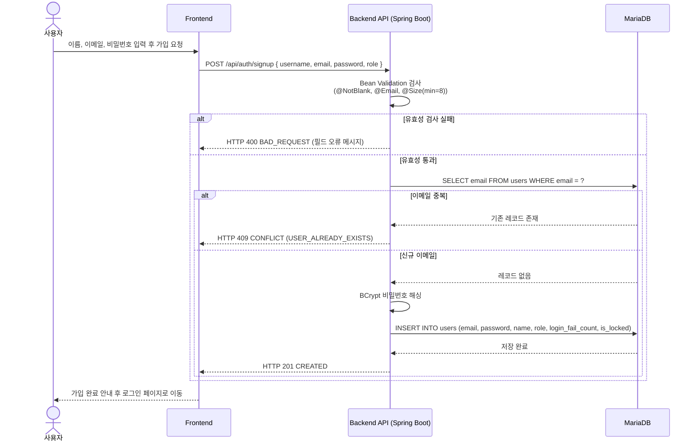
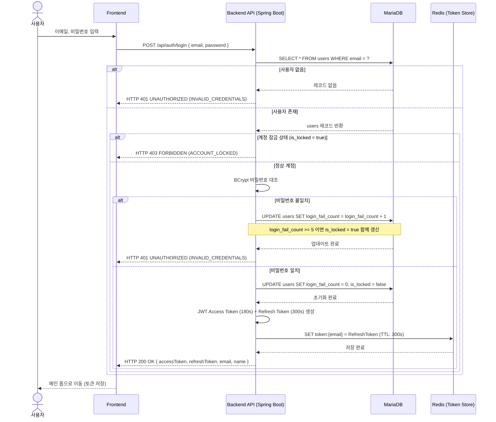
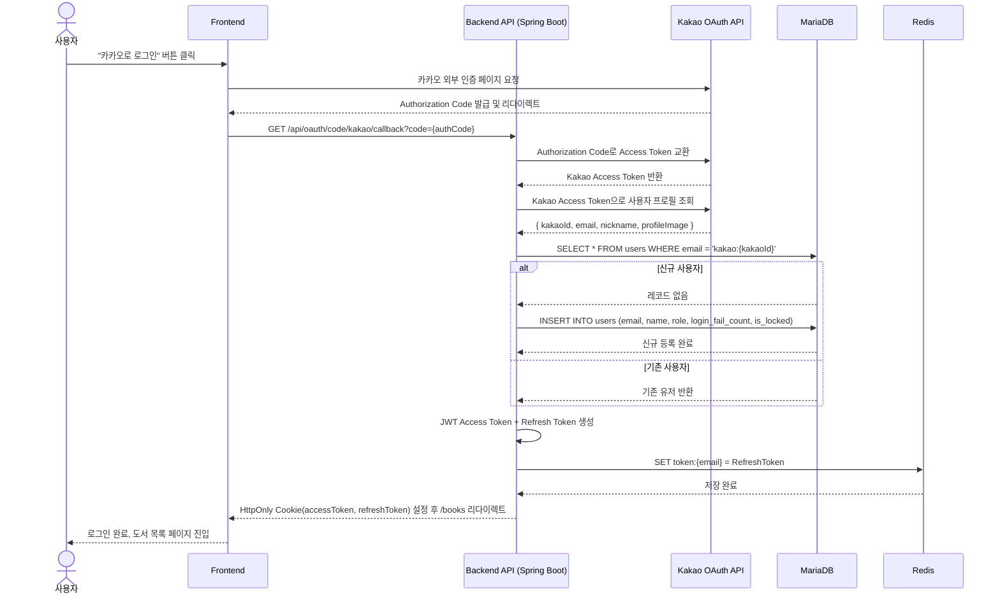
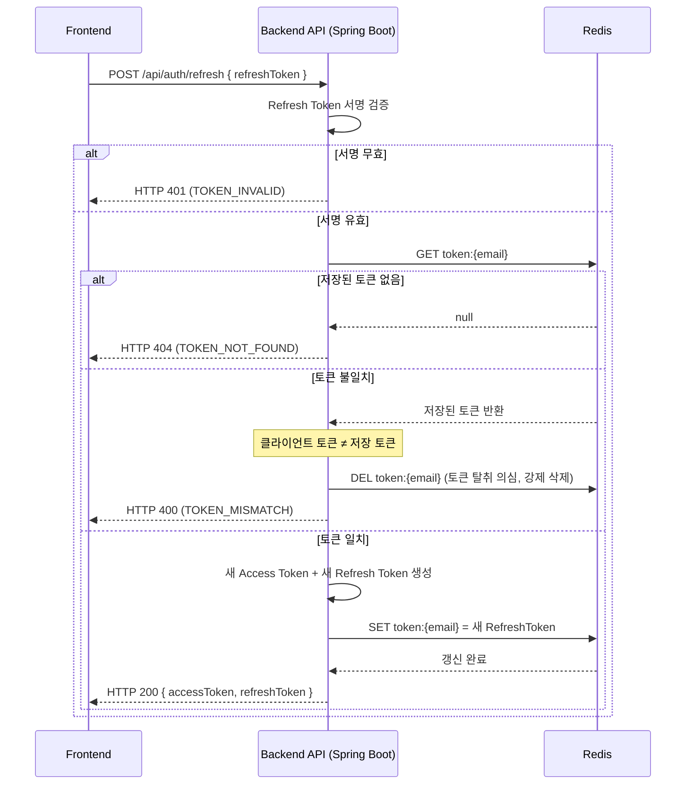
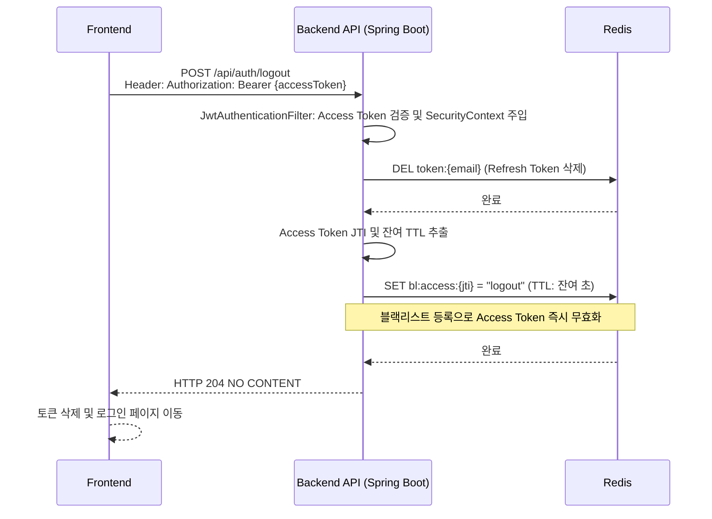

# 🔐 가입 및 로그인 시퀀스 다이어그램 (Auth Sequence Diagram)

이 문서는 사용자가 서비스에 진입하기 위해 거치는 자체 회원가입, 이메일/비밀번호 로그인(계정 잠금 포함), 카카오 OAuth 로그인, 토큰 갱신/로그아웃까지의 핵심 흐름을 설명합니다.

---

## 1. 이메일 회원가입 (`POST /api/auth/signup`) ✅

---

## 2. 이메일 로그인 (`POST /api/auth/login`) ✅

---

## 3. 카카오 OAuth 로그인 (`GET /api/oauth/code/kakao/callback`) ✅

---

## 4. 토큰 갱신 (`POST /api/auth/refresh`) ✅

---

## 5. 로그아웃 (`POST /api/auth/logout`) ✅

---

## 요약: 토큰 생명주기

### Access Token
- **발행**: 로그인/토큰 갱신 시
- **TTL**: 180초 (3분)
- **저장소**: HttpOnly 쿠키 (자동 포함)
- **무효화**: 로그아웃 시 Redis 블랙리스트 등록

### Refresh Token
- **발행**: 로그인/토큰 갱신 시
- **TTL**: 300초 (5분)
- **저장소**: Redis (서버 보관)
- **갱신**: 토큰 갱신 시 새로운 토큰 발급 (기존 토큰 무효화)
- **보안**: 토큰 탈취 시 불일치 감지 → 즉시 세션 강제 만료

### 보안 규칙

1. **Refresh Token Rotation**: 갱신 호출 시 새로운 토큰 발급, 이전 토큰 즉시 무효화
2. **Token Mismatch Detection**: 저장된 토큰과 요청 토큰 불일치 시 토큰 탈취 의심 → 강제 삭제
3. **Access Token Blacklist**: 로그아웃 시 Redis 블랙리스트에 등록, 잔여 TTL 동안 유효하지 않음

