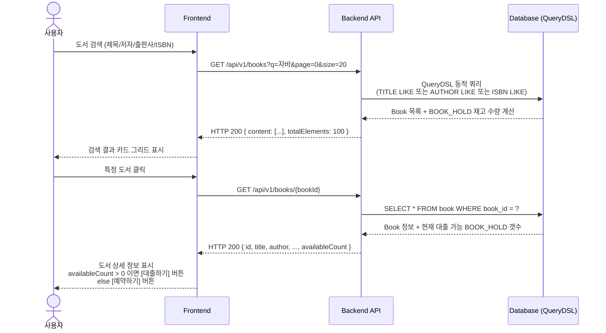
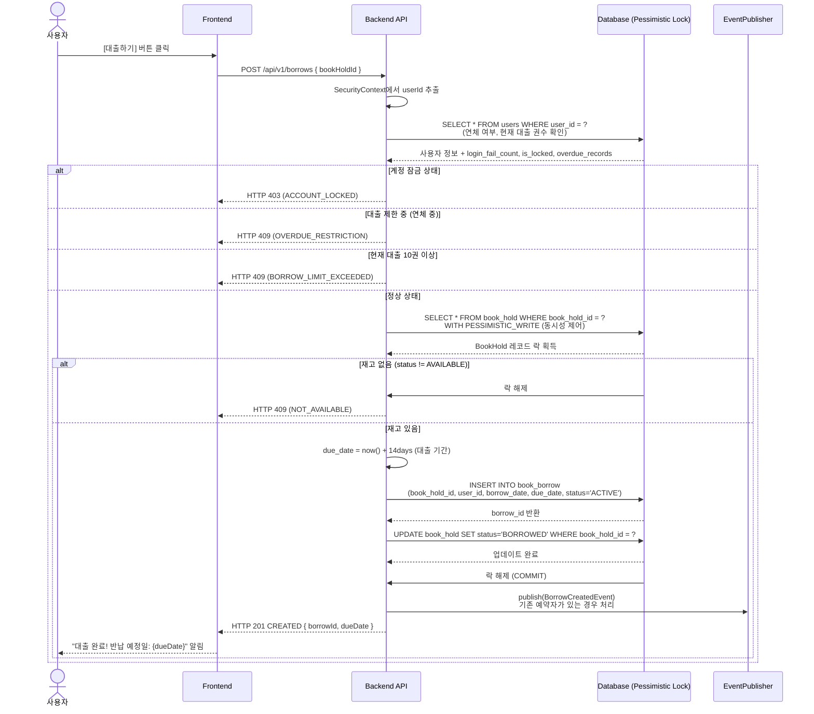
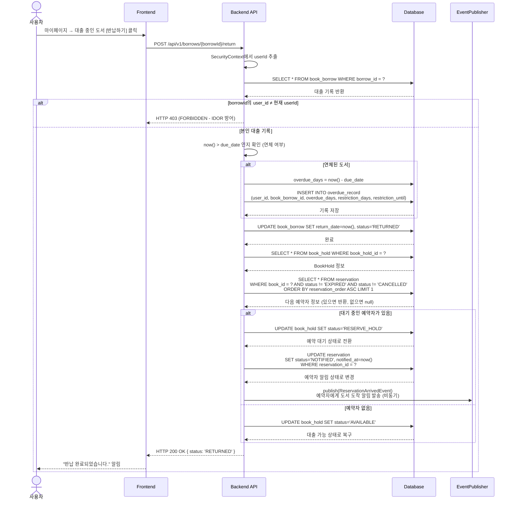
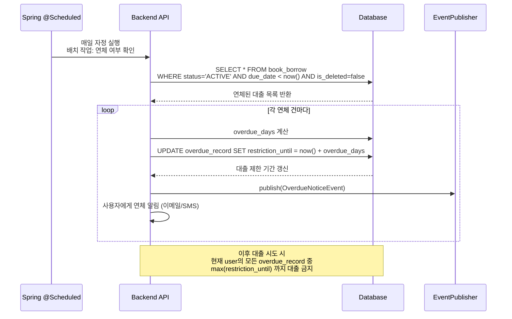

# 📖 도서 검색, 대출 및 반납 시퀀스 다이어그램 (Borrow & Return Sequence)

재고(Hold)가 남아 있는 책을 조회한 뒤, 선점하여 빌리고 시간이 경과 한 뒤 반납하여 다음 차순위자에게 스위칭 시켜주는 핵심 도서 라이프 사이클입니다.

---

## 1. 도서 검색 및 상세 조회



---

## 2. 도서 대출 (`POST /api/v1/borrows`)



---

## 3. 도서 반납 (`POST /api/v1/borrows/{borrowId}/return`)



---

## 4. 연체 및 대출 제한 처리



---

## 5. 상태 다이어그램

### BOOK_HOLD 상태 전이

```
AVAILABLE (대출 가능)
    ↓ POST /api/v1/borrows
BORROWED (대출 중)
    ↓ POST /api/v1/borrows/{id}/return
    ├─→ AVAILABLE (예약자 없음)
    └─→ RESERVE_HOLD (예약자 있음)
        ↓ (4일 경과 또는 사용자 수령)
        ├─→ AVAILABLE
        └─→ BORROWED
```

### BOOK_BORROW 상태

```
ACTIVE (대출 직후)
    ↓ (기한 내 반납)
RETURNED
    또는 (기한 경과)
OVERDUE (배치 작업으로 자동 상태 추적)
```

---

## 동시성 제어 (Pessimistic Lock)

마지막 1권에 대한 동시 대출 요청 시:

```
Time: 10:00:00.000
Thread A: SELECT * FROM book_hold WHERE book_hold_id = 1 WITH PESSIMISTIC_WRITE
  └─ Lock 획득 ✓
  └─ status = 'AVAILABLE' 확인 ✓
  └─ INSERT book_borrow (Thread A)
  └─ UPDATE book_hold SET status='BORROWED'
  └─ COMMIT ✓ (Lock 해제)

Thread B: SELECT * FROM book_hold WHERE book_hold_id = 1 WITH PESSIMISTIC_WRITE
  └─ Lock 대기... (Thread A가 보유 중)
  └─ Lock 획득 ✓
  └─ status = 'BORROWED' 확인 ✗
  └─ HTTP 409 CONFLICT 반환
```

**결과**: 1권은 1명에게만 할당, 나머지는 HTTP 409 거절

