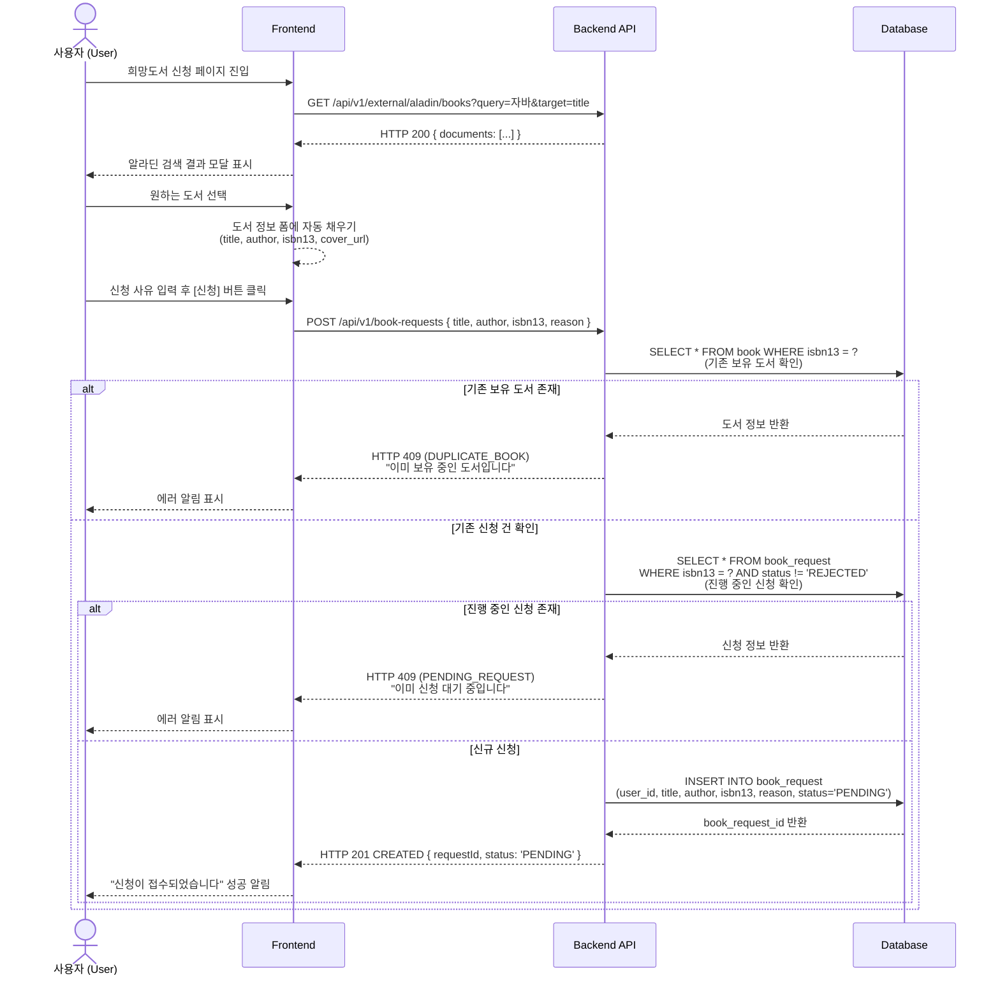
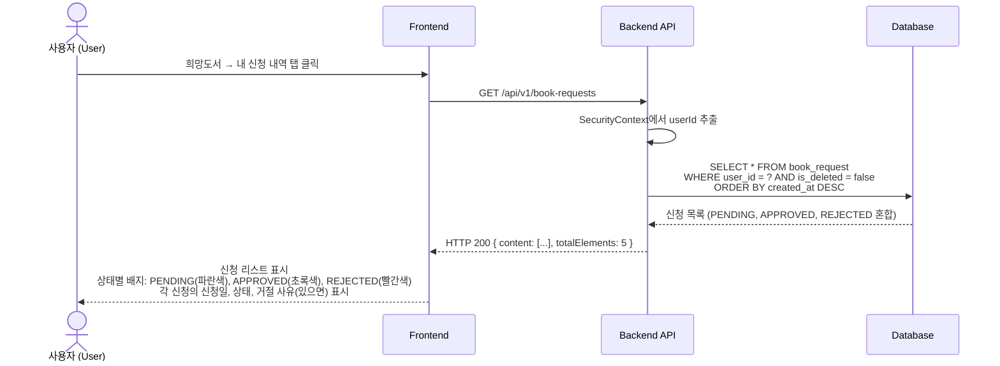
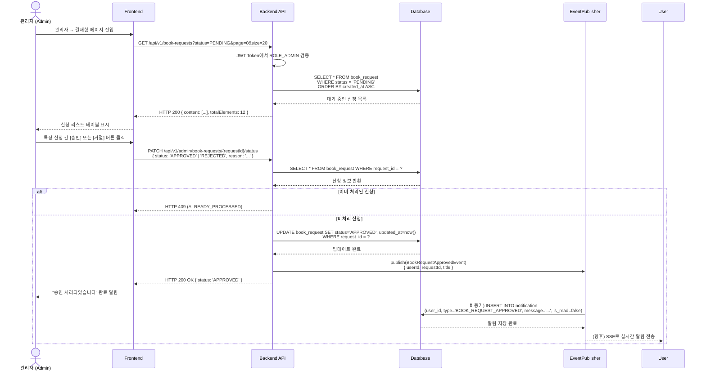
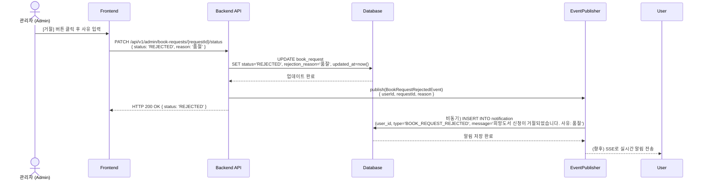
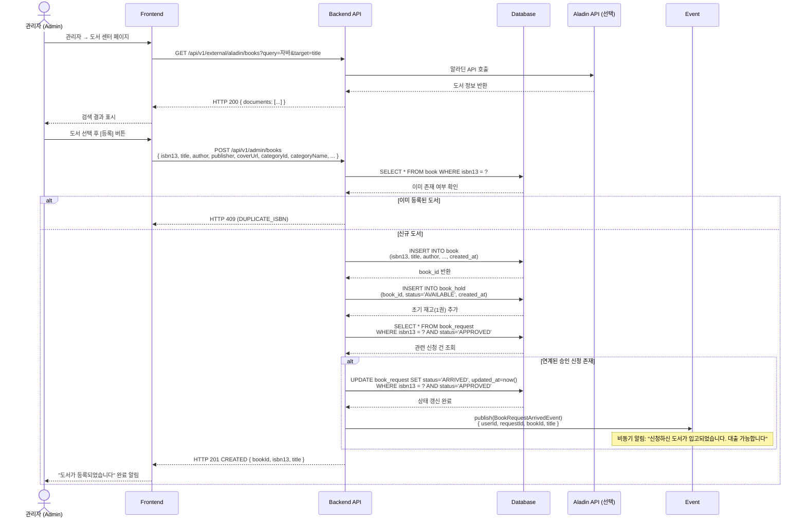

# 📝 희망도서 신청 라이프사이클 시퀀스 다이어그램 (Book Request Lifecycle)

회사 내부에 보유되지 않은 도서를 일반 사원(User)이 관리자에게 요청하고, 관리자(Admin)가 이를 승인하여 시스템에 도서를 추가하는 전체 프로세스입니다.

---

## 1. 사용자의 희망도서 신청 단계



---

## 2. 신청 현황 조회



---

## 3. 관리자의 신청 승인/거절 단계



---

## 4. 거절 처리



---

## 5. 도서 정식 등록 (승인 후 입고)



---

## 상태 다이어그램

### BOOK_REQUEST 상태 전이

```
신청 (PENDING)
   ↓
[관리자 결재]
   ├─→ 승인 (APPROVED) [알림: BOOK_REQUEST_APPROVED]
   │      ↓
   │   [관리자 도서 등록 — POST /admin/books]
   │      ↓
   │   입고 완료 (ARRIVED) [알림: BOOK_REQUEST_ARRIVED]
   │      ↓
   │   사용자 대출 가능
   │
   └─→ 거절 (REJECTED) [이력 보관, 사유 저장, 알림: BOOK_REQUEST_REJECTED]
```

### 전체 라이프사이클

```
1. 사용자 신청 (PENDING)
   ↓
2. 관리자 승인 (APPROVED) [알림 발송: BOOK_REQUEST_APPROVED]
   ↓
3. 실제 도서 구입 후 도서 센터에서 등록 (POST /admin/books)
   ↓
4. Book + BookHold 엔티티 생성
   ↓
5. book_request 상태 → ARRIVED 갱신 [알림 발송: BOOK_REQUEST_ARRIVED]
   ↓
6. 사용자 대출 가능
```

---

## API 응답 예시

### 신청 목록 조회 (사용자)

```json
{
  "content": [
    {
      "id": 1,
      "title": "자바의 정석",
      "author": "남궁성",
      "isbn13": "9788994492032",
      "reason": "Java 입문서로 필독서 같습니다",
      "status": "APPROVED",
      "rejectionReason": null,
      "createdAt": "2026-03-20T10:30:00Z",
      "updatedAt": "2026-03-21T15:45:00Z"
    },
    {
      "id": 2,
      "title": "클린 코드",
      "author": "로버트 마틴",
      "isbn13": "9788966261031",
      "reason": "코드 품질 개선을 위해",
      "status": "REJECTED",
      "rejectionReason": "품절",
      "createdAt": "2026-03-15T09:00:00Z",
      "updatedAt": "2026-03-18T14:30:00Z"
    }
  ],
  "page": 0,
  "size": 20,
  "totalElements": 2
}
```

### 신청 목록 조회 (관리자)

```json
{
  "content": [
    {
      "id": 1,
      "userId": 5,
      "userName": "김철수",
      "title": "자바의 정석",
      "author": "남궁성",
      "isbn13": "9788994492032",
      "reason": "Java 입문서로 필독서 같습니다",
      "status": "PENDING",
      "createdAt": "2026-03-20T10:30:00Z"
    },
    {
      "id": 3,
      "userId": 7,
      "userName": "이영희",
      "title": "스프링 인액션",
      "author": "크레이그 월스",
      "isbn13": "9788960776456",
      "reason": "Spring Framework 학습",
      "status": "PENDING",
      "createdAt": "2026-03-19T14:15:00Z"
    }
  ],
  "page": 0,
  "size": 20,
  "totalElements": 2
}
```

