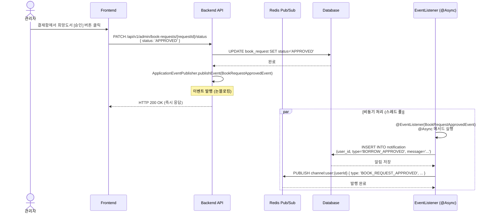
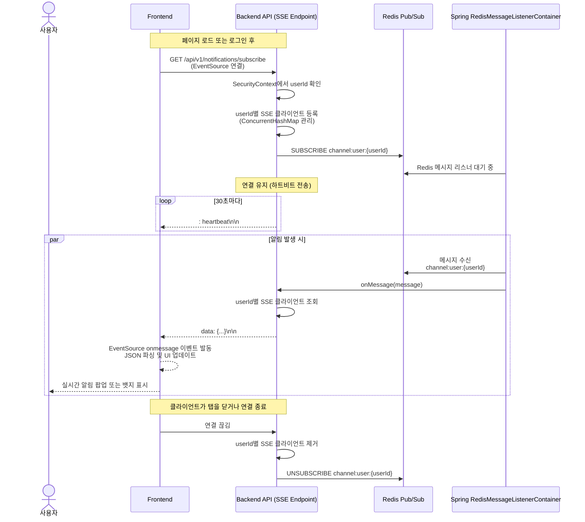
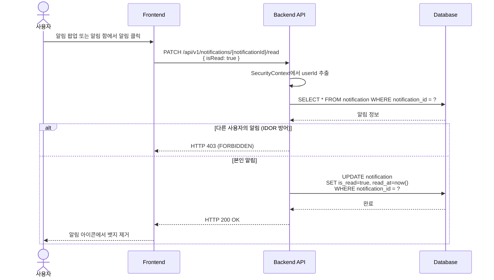
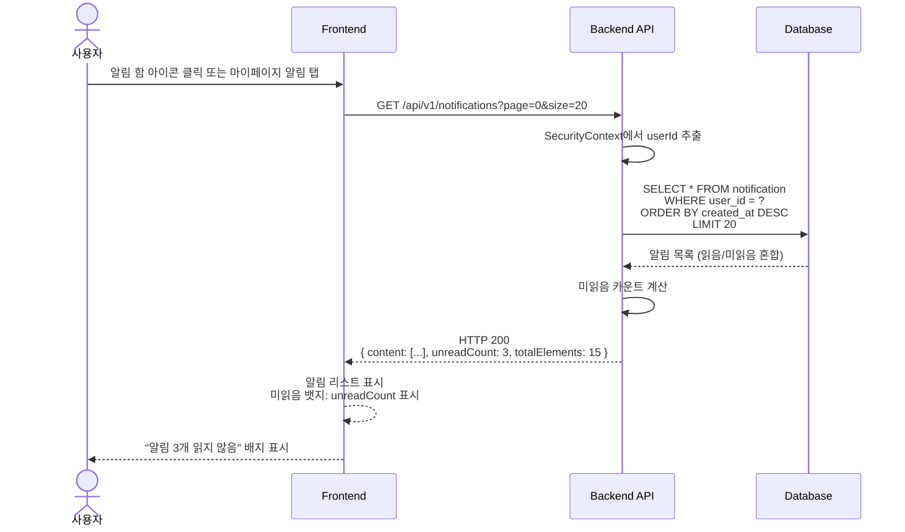
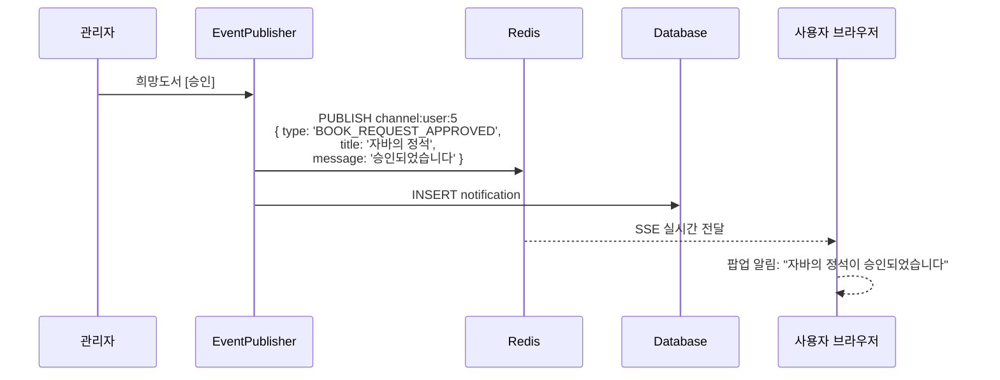
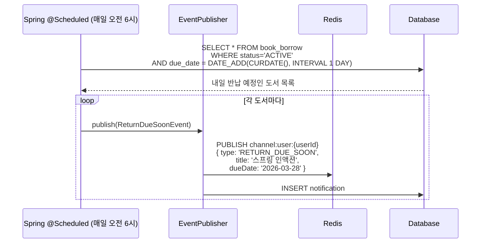
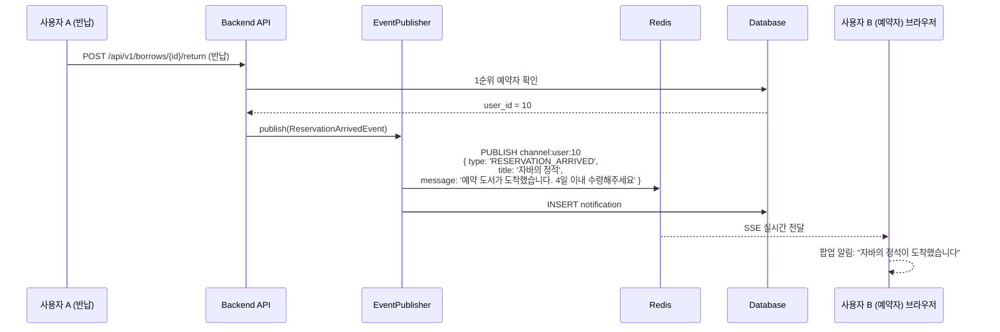

# 🔔 실시간 알림 시스템 시퀀스 (Redis Pub/Sub + SSE)

부기맨의 알림 시스템은 Redis Pub/Sub을 통한 백엔드 이벤트 발행과 Spring SSE(Server-Sent Events)를 통한 클라이언트 실시간 전달로 구성됩니다.

---

## 1. 이벤트 기반 알림 발행 (희망도서 승인 예시)



---

## 2. 클라이언트 SSE 구독 및 실시간 수신



---

## 3. 알림 읽음 처리



---

## 4. 알림 목록 조회 및 미읽음 카운트



---

## 5. 알림 발송 이벤트 종류

### 희망도서 신청 결과



### 반납 예정일 알림



### 예약 도서 도착 알림



---

## 6. SSE 연결 구현 상세

### Server-side (Spring Boot)

```java
@RestController
@RequestMapping("/api/v1/notifications")
public class NotificationController {

    private final SseEmitterMap emitterMap; // userId -> SseEmitter

    @GetMapping("/subscribe")
    public SseEmitter subscribe() {
        Long userId = SecurityUtils.getCurrentUserId();
        SseEmitter emitter = new SseEmitter(300000L); // 5분 타임아웃

        emitterMap.put(userId, emitter);

        try {
            emitter.send(SseEmitter.event()
                .id(UUID.randomUUID().toString())
                .name("connected")
                .data("Connection established"));
        } catch (IOException e) {
            emitterMap.remove(userId);
        }

        return emitter;
    }
}

@Component
public class RedisMessageListener {

    private final SseEmitterMap emitterMap;

    @EventListener
    public void onBookRequestApproved(BookRequestApprovedEvent event) {
        Long userId = event.getUserId();
        SseEmitter emitter = emitterMap.get(userId);

        if (emitter != null) {
            try {
                emitter.send(SseEmitter.event()
                    .id(UUID.randomUUID().toString())
                    .name("notification")
                    .data(new NotificationDto(
                        "BORROW_APPROVED",
                        "희망도서 신청이 승인되었습니다",
                        event.getTitle()
                    )));
            } catch (IOException e) {
                emitterMap.remove(userId);
            }
        }
    }
}
```

### Client-side (JavaScript)

```javascript
function subscribeToNotifications() {
    const eventSource = new EventSource('/api/v1/notifications/subscribe');

    eventSource.addEventListener('connected', (e) => {
        console.log('SSE 연결 성공');
    });

    eventSource.addEventListener('notification', (e) => {
        const notification = JSON.parse(e.data);
        showNotificationPopup(notification);
        updateNotificationBadge();
    });

    eventSource.onerror = (e) => {
        console.error('SSE 연결 끊김', e);
        eventSource.close();
        // 재연결 로직
    };
}

function showNotificationPopup(notification) {
    const message = `${notification.type === 'BORROW_APPROVED'
        ? '승인됨'
        : notification.type === 'RESERVATION_ARRIVED'
        ? '도착함'
        : '알림'}: ${notification.message}`;

    // SweetAlert2 또는 Toast 알림
    Swal.fire({
        icon: 'success',
        title: '새 알림',
        text: message,
        timer: 5000
    });
}

function markAsRead(notificationId) {
    fetch(`/api/v1/notifications/${notificationId}/read`, {
        method: 'PATCH',
        headers: { 'Content-Type': 'application/json' },
        body: JSON.stringify({ isRead: true })
    })
    .then(r => r.json())
    .then(() => updateNotificationBadge());
}
```

---

## 알림 타입 및 트리거 정의

| 타입 | 트리거 | 발행자 | 수신자 | 구현 상태 |
|------|--------|--------|--------|---------|
| `BOOK_REQUEST_APPROVED` | 희망도서 신청 승인 | EventListener | 신청 사용자 | ✅ 완료 (UI 전달 대기) |
| `BOOK_REQUEST_REJECTED` | 희망도서 신청 거절 | EventListener | 신청 사용자 | ✅ 완료 (UI 전달 대기) |
| `BOOK_REQUEST_ARRIVED` | 희망도서 실물 입고 완료 | EventListener | 신청 사용자 | ❌ 미구현 |
| `RESERVATION_ARRIVED` | 예약 도서 반납 (1순위) | EventListener | 예약 사용자 | ❌ 미구현 (EventListener 등록 필요) |
| `RETURN_DUE_SOON` | 반납 예정일 1일 전 | @Scheduled | 대출 사용자 | ❌ 미구현 (배치 작업 필요) |
| `OVERDUE_NOTICE` | 연체 발생 | EventListener | 연체 사용자 | ❌ 미구현 (배치 작업 필요) |

---

## 구현 로드맵

### Phase 1: 알림 저장 (완료 ✅)
- Notification 엔티티 및 리포지토리
- 알림 조회 및 읽음 처리 API

### Phase 2: Redis Pub/Sub 통합 (대기 중)
- RedisMessageListener 구현
- 이벤트별 채널 발행 로직

### Phase 3: SSE 연결 (대기 중)
- `/api/v1/notifications/subscribe` 엔드포인트
- SseEmitter 관리 및 브로드캐스트
- 클라이언트 EventSource 구현

### Phase 4: 배치 작업 (대기 중)
- 반납 예정일 1일 전 알림 (@Scheduled)
- 연체 알림 발송
- 4일 자동 승계 스케줄러 (기존 예약 로직)

