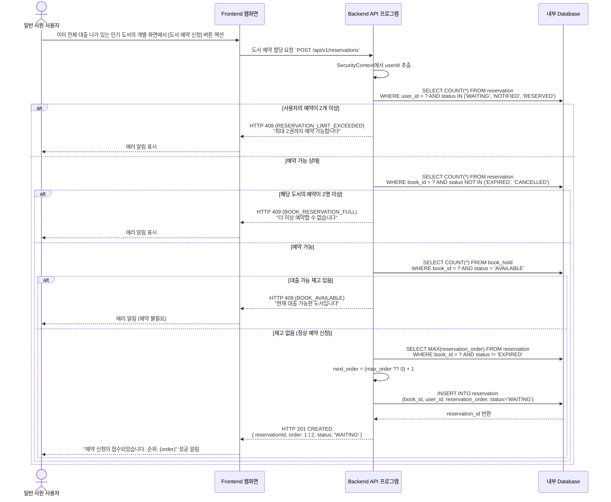
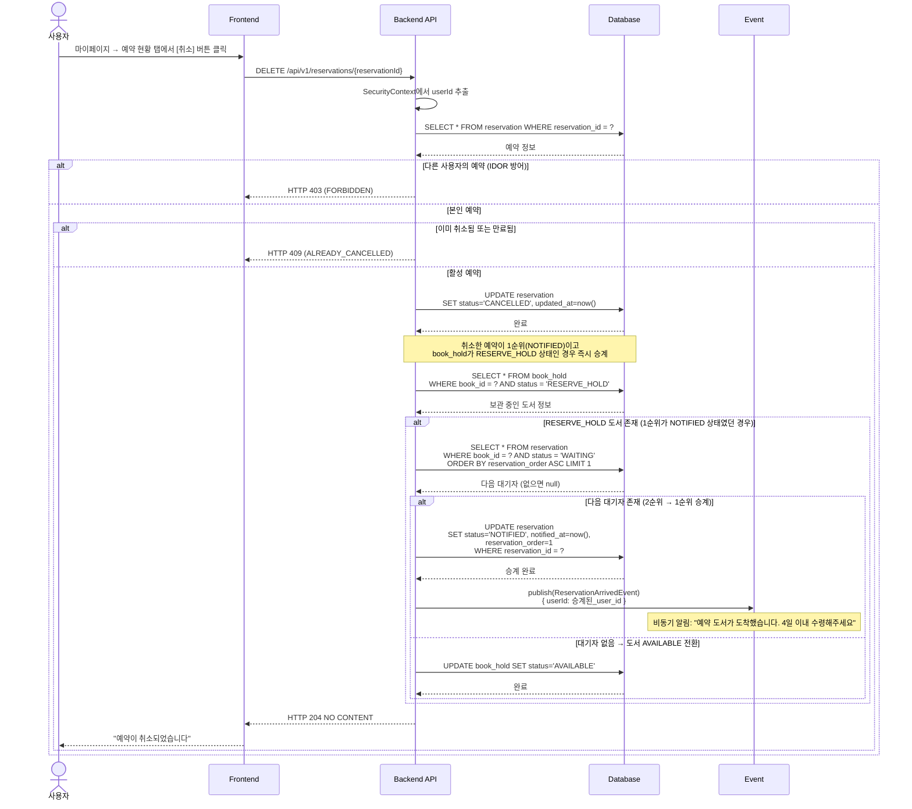
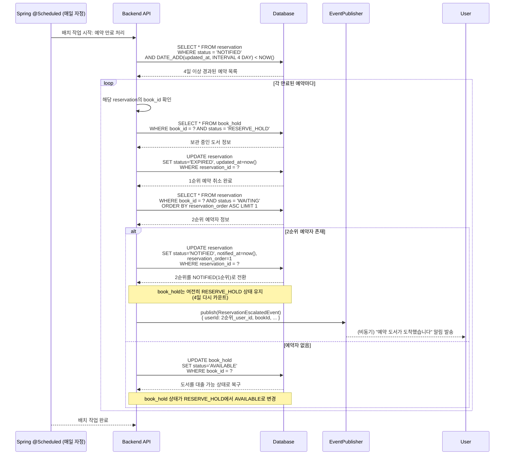
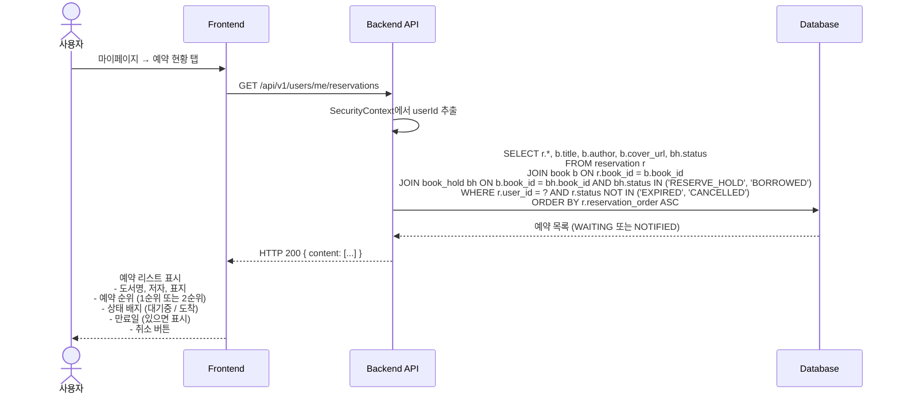

# 📅 도서 예약 대기 및 4일 자동 승계 시퀀스 (Reservation Sequence)

회사 내 남은 수량이 없어서 모두 타인이 보관하고 있는 책(재고 0권)에 대하여 대기표를 먼저 선점하는 시퀀스와 그 만료 자동화 구조입니다.

---

## 1. 도서 예약 신청 프로세스



---

## 2. 예약 취소



---

## 3. 4일 자동 승계 스케줄러 (배치 작업)



---

## 4. 예약 현황 조회



---

## 상태 다이어그램

### RESERVATION 상태 전이

```
신청 (WAITING)
  ↓ (도서 반납 시)
알림 전송 (NOTIFIED)
  ├─→ (4일 경과)
  │   ├─→ 만료 (EXPIRED) [2순위 없음]
  │   └─→ 승계 (WAITING → NOTIFIED)
  │
  └─→ (사용자 수령)
      확정 (RESERVED)

또는 사용자 취소 → 취소됨 (CANCELLED)
```

### BOOK_HOLD 상태 전이 (예약 관점)

```
BORROWED (도서 대출 중)
  ↓ (반납)
RESERVE_HOLD (예약자가 있음)
  ├─→ (4일 경과)
  │   ├─→ AVAILABLE (2순위 예약자 없음)
  │   └─→ BORROWED (2순위 있음, 대출 진행)
  │
  └─→ (사용자가 4일 이내 수령)
      BORROWED (또는 AVAILABLE)
```

---

## 예약 순서 관리 (order 필드의 역할)

| 상황 | reservation_order | 상태 | 설명 |
|------|-------------------|------|------|
| 첫 번째 예약 | 1 | WAITING | 차순위 예약자 (즉시 도서 도착 시 수령 가능) |
| 두 번째 예약 | 2 | WAITING | 차차순위 (1순위 만료 후 승계) |
| 세 번째 예약 신청 | N/A | 거절 | 최대 2명까지만 허용 |

---

## 알림 발송 시점

| 이벤트 | 트리거 | 수신자 | 메시지 |
|--------|--------|--------|--------|
| 예약 신청 | POST /reservations | 사용자 | "예약이 접수되었습니다. 순위: 1순위" |
| 도서 도착 | POST /borrows/{id}/return (반납) | 1순위 예약자 | "예약 도서가 도착했습니다. 4일 이내 수령해주세요" |
| 4일 경과 후 승계 | @Scheduled (배치) | 2순위 예약자 | "예약 도서가 도착했습니다. 4일 이내 수령해주세요" |
| 예약 취소 | DELETE /reservations/{id} | 사용자 | "예약이 취소되었습니다" |

