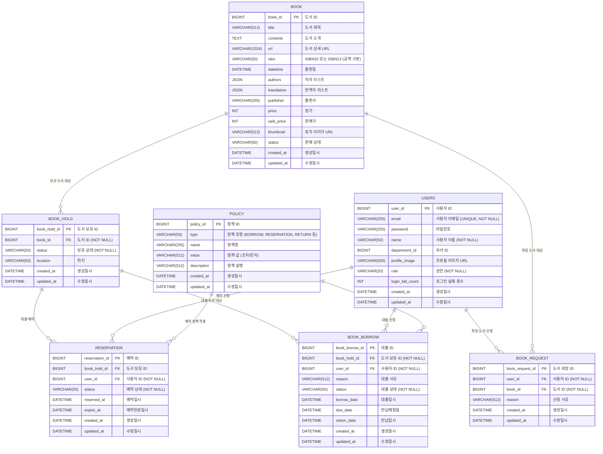

# 📘 부기맨 도서관리시스템 ERD

```mermaid
erDiagram

    USERS {
        BIGINT          user_id          PK "사용자 ID"
        VARCHAR(255)    email               "사용자 이메일 (UNIQUE, NOT NULL)"
        VARCHAR(255)    password            "비밀번호"
        VARCHAR(50)     name                "사용자 이름 (NOT NULL)"
        BIGINT          department_id       "부서 ID"
        VARCHAR(500)    profile_image       "프로필 이미지 URL"
        VARCHAR(20)     role                "권한 (NOT NULL)"
        INT             login_fail_count    "로그인 실패 횟수"
        DATETIME        created_at          "생성일시"
        DATETIME        updated_at          "수정일시"
    }

    BOOK {
        BIGINT       book_id        PK "도서 ID"
        VARCHAR(512) title          "도서 제목"
        TEXT         contents       "도서 소개"
        VARCHAR(1024) url           "도서 상세 URL"
        VARCHAR(50)  isbn           "ISBN10 또는 ISBN13 (공백 구분)"
        DATETIME     datetime       "출판일"
        JSON         authors        "저자 리스트"
        JSON         translators    "번역자 리스트"
        VARCHAR(255) publisher      "출판사"
        INT          price          "정가"
        INT          sale_price     "판매가"
        VARCHAR(512) thumbnail      "표지 이미지 URL"
        VARCHAR(50)  status         "판매 상태"
        DATETIME     created_at     "생성일시"
        DATETIME     updated_at     "수정일시"
    }

    BOOK_HOLD {
        BIGINT      book_hold_id    PK  "도서 보유 ID"
        BIGINT      book_id         FK  "도서 ID (NOT NULL)"
        VARCHAR(50) status              "보유 상태 (NOT NULL)"
        VARCHAR(50) location            "위치"
        DATETIME    created_at          "생성일시"
        DATETIME    updated_at          "수정일시"
    }

    RESERVATION {
        BIGINT      reservation_id  PK  "예약 ID"
        BIGINT      book_hold_id    FK  "도서 보유 ID"
        BIGINT      user_id         FK  "사용자 ID (NOT NULL)"
        VARCHAR(50) status              "예약 상태 (NOT NULL)"
        DATETIME    reserved_at         "예약일시"
        DATETIME    expire_at           "예약만료일시"
        DATETIME    created_at          "생성일시"
        DATETIME    updated_at          "수정일시"
    }

    BOOK_BORROW {
        BIGINT          book_borrow_id  PK  "대출 ID"
        BIGINT          book_hold_id    FK  "도서 보유 ID (NOT NULL)"
        BIGINT          user_id         FK  "사용자 ID (NOT NULL)"
        VARCHAR(512)    reason              "대출 사유"
        VARCHAR(50)     status              "대출 상태 (NOT NULL)"
        DATETIME        borrow_date         "대출일시"
        DATETIME        due_date            "반납예정일"
        DATETIME        return_date         "반납일시"
        DATETIME        created_at          "생성일시"
        DATETIME        updated_at          "수정일시"
    }

    BOOK_REQUEST {
        BIGINT       book_request_id     PK  "도서 희망 ID"
        BIGINT       user_id             FK  "사용자 ID (NOT NULL)"
        BIGINT       book_id             FK  "도서 ID (NOT NULL)"
        VARCHAR(512) reason                  "신청 사유"
        DATETIME     created_at              "생성일시"
        DATETIME     updated_at              "수정일시"
    }

    POLICY {
        BIGINT       policy_id       PK  "정책 ID"
        VARCHAR(50)  type                "정책 유형 (BORROW, RESERVATION, RETURN 등)"
        VARCHAR(255) name                "정책명"
        VARCHAR(512) value               "정책 값 (숫자/문자)"
        VARCHAR(512) description         "정책 설명"
        DATETIME     created_at          "생성일시"
        DATETIME     updated_at          "수정일시"
    }

    %% 관계(논리적 FK)
    USERS ||--o{ BOOK_REQUEST : "희망 도서 신청"
    BOOK ||--o{ BOOK_HOLD : "보유 도서 대상"
    BOOK ||--o{ BOOK_REQUEST : "희망 도서 대상"
    BOOK_HOLD ||--o{ RESERVATION : "대출 예약"
    BOOK_HOLD ||--o{ BOOK_BORROW : "대출 도서 대상"
    USERS ||--o{ BOOK_BORROW : "대출 신청"
    USERS ||--o{ RESERVATION : "예약 신청"

    POLICY ||--o{ BOOK_BORROW : "대출 정책 적용"
    POLICY ||--o{ RESERVATION : "예약 정책 적용"

```