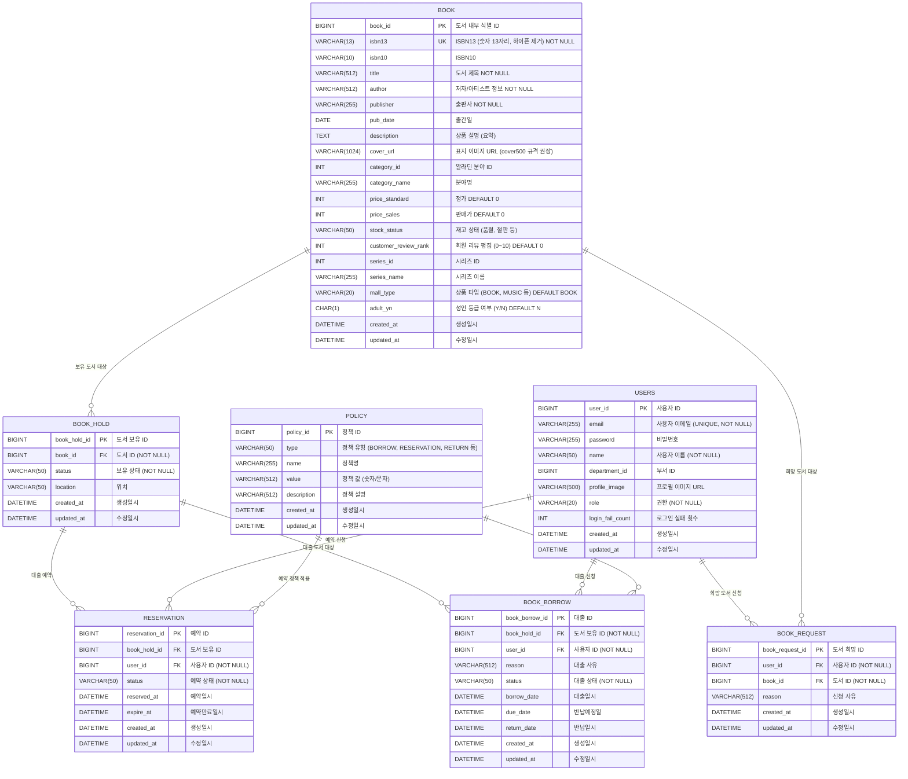

# 📘 부기맨 도서관리시스템 ERD

```mermaid
erDiagram

    USERS {
        BIGINT          user_id          PK "사용자 ID"
        VARCHAR(255)    email               "사용자 이메일 (UNIQUE, NOT NULL)"
        VARCHAR(255)    password            "비밀번호"
        VARCHAR(50)     name                "사용자 이름 (NOT NULL)"
        BIGINT          department_id       "부서 ID"
        VARCHAR(500)    profile_image       "프로필 이미지 URL"
        VARCHAR(20)     role                "권한 (NOT NULL)"
        INT             login_fail_count    "로그인 실패 횟수"
        DATETIME        created_at          "생성일시"
        DATETIME        updated_at          "수정일시"
    }

    BOOK {
        BIGINT       book_id              PK  "도서 내부 식별 ID"
        VARCHAR(13)  isbn13               UK  "ISBN13 (숫자 13자리, 하이픈 제거) NOT NULL"
        VARCHAR(10)  isbn10                   "ISBN10"
        VARCHAR(512) title                    "도서 제목 NOT NULL"
        VARCHAR(512) author                   "저자/아티스트 정보 NOT NULL"
        VARCHAR(255) publisher                "출판사 NOT NULL"
        DATE         pub_date                 "출간일"
        TEXT         description              "상품 설명 (요약)"
        VARCHAR(1024) cover_url              "표지 이미지 URL (cover500 규격 권장)"
        INT          category_id              "알라딘 분야 ID"
        VARCHAR(255) category_name            "분야명"
        INT          price_standard           "정가 DEFAULT 0"
        INT          price_sales              "판매가 DEFAULT 0"
        VARCHAR(50)  stock_status             "재고 상태 (품절, 절판 등)"
        INT          customer_review_rank     "회원 리뷰 평점 (0~10) DEFAULT 0"
        INT          series_id                "시리즈 ID"
        VARCHAR(255) series_name              "시리즈 이름"
        VARCHAR(20)  mall_type                "상품 타입 (BOOK, MUSIC 등) DEFAULT BOOK"
        CHAR(1)      adult_yn                 "성인 등급 여부 (Y/N) DEFAULT N"
        DATETIME     created_at               "생성일시"
        DATETIME     updated_at               "수정일시"
    }

    BOOK_HOLD {
        BIGINT      book_hold_id    PK  "도서 보유 ID"
        BIGINT      book_id         FK  "도서 ID (NOT NULL)"
        VARCHAR(50) status              "보유 상태 (NOT NULL)"
        VARCHAR(50) location            "위치"
        DATETIME    created_at          "생성일시"
        DATETIME    updated_at          "수정일시"
    }

    RESERVATION {
        BIGINT      reservation_id  PK  "예약 ID"
        BIGINT      book_hold_id    FK  "도서 보유 ID"
        BIGINT      user_id         FK  "사용자 ID (NOT NULL)"
        VARCHAR(50) status              "예약 상태 (NOT NULL)"
        DATETIME    reserved_at         "예약일시"
        DATETIME    expire_at           "예약만료일시"
        DATETIME    created_at          "생성일시"
        DATETIME    updated_at          "수정일시"
    }

    BOOK_BORROW {
        BIGINT          book_borrow_id  PK  "대출 ID"
        BIGINT          book_hold_id    FK  "도서 보유 ID (NOT NULL)"
        BIGINT          user_id         FK  "사용자 ID (NOT NULL)"
        VARCHAR(512)    reason              "대출 사유"
        VARCHAR(50)     status              "대출 상태 (NOT NULL)"
        DATETIME        borrow_date         "대출일시"
        DATETIME        due_date            "반납예정일"
        DATETIME        return_date         "반납일시"
        DATETIME        created_at          "생성일시"
        DATETIME        updated_at          "수정일시"
    }

    BOOK_REQUEST {
        BIGINT       book_request_id     PK  "도서 희망 ID"
        BIGINT       user_id             FK  "사용자 ID (NOT NULL)"
        BIGINT       book_id             FK  "도서 ID (NOT NULL)"
        VARCHAR(512) reason                  "신청 사유"
        DATETIME     created_at              "생성일시"
        DATETIME     updated_at              "수정일시"
    }

    POLICY {
        BIGINT       policy_id       PK  "정책 ID"
        VARCHAR(50)  type                "정책 유형 (BORROW, RESERVATION, RETURN 등)"
        VARCHAR(255) name                "정책명"
        VARCHAR(512) value               "정책 값 (숫자/문자)"
        VARCHAR(512) description         "정책 설명"
        DATETIME     created_at          "생성일시"
        DATETIME     updated_at          "수정일시"
    }

    %% 관계(논리적 FK)
    USERS ||--o{ BOOK_REQUEST : "희망 도서 신청"
    BOOK ||--o{ BOOK_HOLD : "보유 도서 대상"
    BOOK ||--o{ BOOK_REQUEST : "희망 도서 대상"
    BOOK_HOLD ||--o{ RESERVATION : "대출 예약"
    BOOK_HOLD ||--o{ BOOK_BORROW : "대출 도서 대상"
    USERS ||--o{ BOOK_BORROW : "대출 신청"
    USERS ||--o{ RESERVATION : "예약 신청"

    POLICY ||--o{ BOOK_BORROW : "대출 정책 적용"
    POLICY ||--o{ RESERVATION : "예약 정책 적용"

```