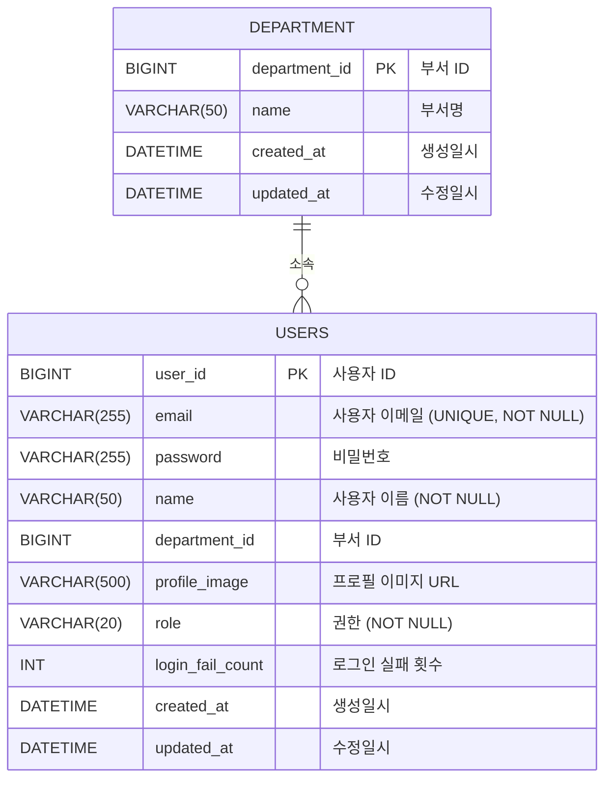

```mermaid
erDiagram
    USERS {
        BIGINT          user_id          PK "사용자 ID"
        VARCHAR(255)    email               "사용자 이메일 (UNIQUE, NOT NULL)"
        VARCHAR(255)    password            "비밀번호"
        VARCHAR(50)     name                "사용자 이름 (NOT NULL)"
        BIGINT          department_id       "부서 ID"
        VARCHAR(500)    profile_image       "프로필 이미지 URL"
        VARCHAR(20)     role                "권한 (NOT NULL)"
        INT             login_fail_count    "로그인 실패 횟수"
        DATETIME        created_at          "생성일시"
        DATETIME        updated_at          "수정일시"
    }

    DEPARTMENT {
        BIGINT      department_id   PK  "부서 ID"
        VARCHAR(50) name                "부서명"
        DATETIME    created_at          "생성일시"
        DATETIME    updated_at          "수정일시"
    }

    DEPARTMENT ||--o{ USERS : "소속"
```