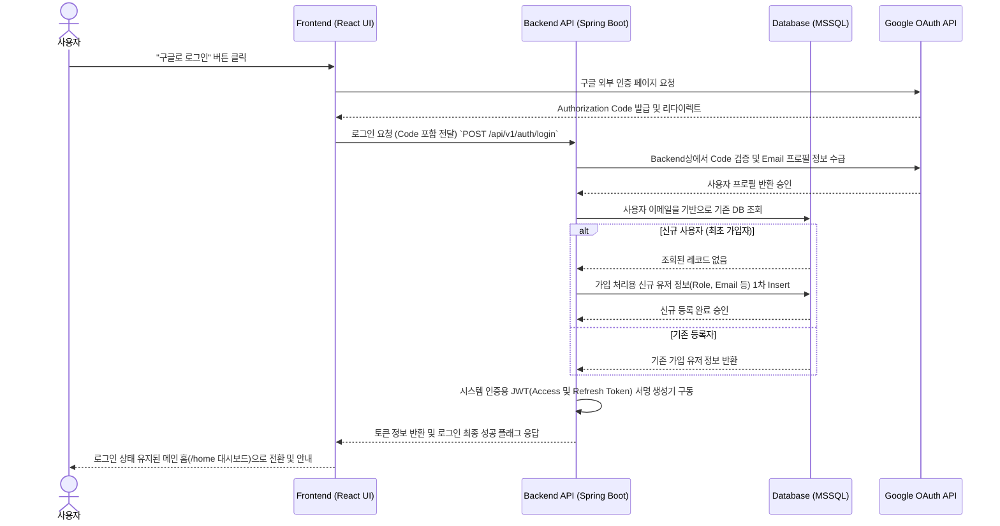

# 가입 및 로그인 시퀀스 다이어그램 (Auth Sequence Diagram)

이 문서는 사용자가 서비스에 진입하기 위해 거치는 자체 회원가입, 자격 요건 판별, 그리고 OAuth 등 로그인 토큰 발급까지의 핵심 흐름을 설명합니다.

```mermaid
sequenceDiagram
    actor User as 사용자
    participant Client as Frontend (React UI)
    participant Server as Backend API (Spring Boot)
    participant DB as Database (MSSQL)
    participant OAuth as Google OAuth API

    %% 회원가입 및 OAuth 로그인 흐름
    User->>Client: "구글로 로그인" 버튼 클릭
    Client->>OAuth: 구글 외부 인증 페이지 요청
    OAuth-->>Client: Authorization Code 발급 및 리다이렉트
    Client->>Server: 로그인 요청 (Code 포함 전달) `POST /api/v1/auth/login`
    Server->>OAuth: Backend상에서 Code 검증 및 Email 프로필 정보 수급
    OAuth-->>Server: 사용자 프로필 반환 승인
    Server->>DB: 사용자 이메일을 기반으로 기존 DB 조회
    
    alt 신규 사용자 (최초 가입자)
        DB-->>Server: 조회된 레코드 없음
        Server->>DB: 가입 처리용 신규 유저 정보(Role, Email 등) 1차 Insert 
        DB-->>Server: 신규 등록 완료 승인
    else 기존 등록자
        DB-->>Server: 기존 가입 유저 정보 반환
    end

    Server->>Server: 시스템 인증용 JWT(Access 및 Refresh Token) 서명 생성기 구동
    Server-->>Client: 토큰 정보 반환 및 로그인 최종 성공 플래그 응답
    Client-->>User: 로그인 상태 유지된 메인 홈(/home 대시보드)으로 전환 및 안내
```
