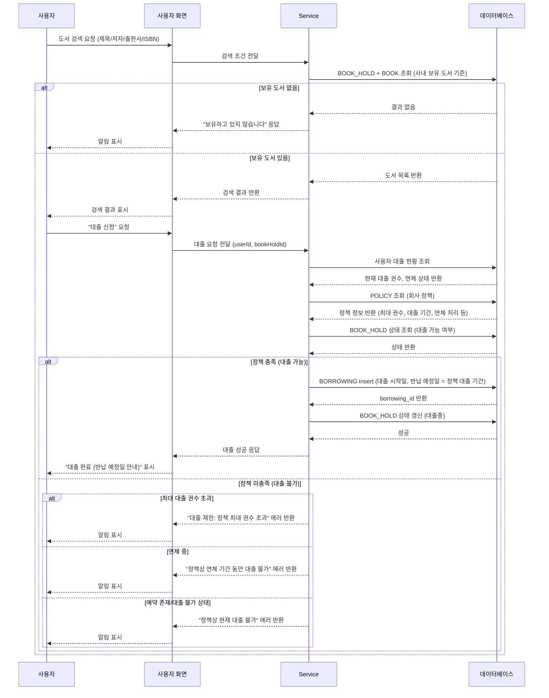

```mermaid
sequenceDiagram
    participant User as 사용자
    participant UI as 사용자 화면
    participant Svc as Service
    participant DB as 데이터베이스

    User ->> UI: 도서 검색 요청 (제목/저자/출판사/ISBN)
    UI ->> Svc: 검색 조건 전달
    Svc ->> DB: BOOK_HOLD + BOOK 조회 (사내 보유 도서 기준)
    alt 보유 도서 없음
        DB -->> Svc: 결과 없음
        Svc -->> UI: "보유하고 있지 않습니다" 응답
        UI -->> User: 알림 표시
    else 보유 도서 있음
        DB -->> Svc: 도서 목록 반환
        Svc -->> UI: 검색 결과 반환
        UI -->> User: 검색 결과 표시

        User ->> UI: "대출 신청" 요청
        UI ->> Svc: 대출 요청 전달 (userId, bookHoldId)

        Svc ->> DB: 사용자 대출 현황 조회
        DB -->> Svc: 현재 대출 권수, 연체 상태 반환
        Svc ->> DB: POLICY 조회 (회사 정책)
        DB -->> Svc: 정책 정보 반환 (최대 권수, 대출 기간, 연체 처리 등)
        Svc ->> DB: BOOK_HOLD 상태 조회 (대출 가능 여부)
        DB -->> Svc: 상태 반환

        alt 정책 충족 (대출 가능)
            Svc ->> DB: BORROWING insert (대출 시작일, 반납 예정일 = 정책 대출 기간)
            DB -->> Svc: borrowing_id 반환
            Svc ->> DB: BOOK_HOLD 상태 갱신 (대출중)
            DB -->> Svc: 성공
            Svc -->> UI: 대출 성공 응답
            UI -->> User: "대출 완료 (반납 예정일 안내)" 표시
        else 정책 미충족 (대출 불가)
            alt 최대 대출 권수 초과
                Svc -->> UI: "대출 제한: 정책 최대 권수 초과" 에러 반환
                UI -->> User: 알림 표시
            else 연체 중
                Svc -->> UI: "정책상 연체 기간 동안 대출 불가" 에러 반환
                UI -->> User: 알림 표시
            else 예약 존재/대출 불가 상태
                Svc -->> UI: "정책상 현재 대출 불가" 에러 반환
                UI -->> User: 알림 표시
            end
        end
    end
```