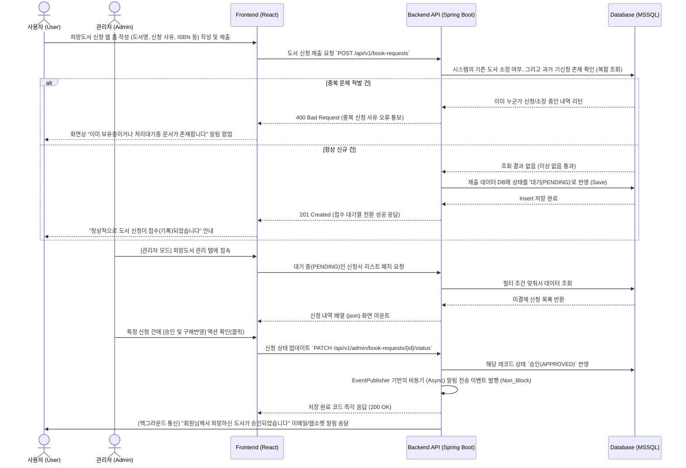

# 희망도서 신청 시퀀스 다이어그램 (Book Request Sequence Diagram)

회사 내부에 보유되지 않은 도서를 일반 사원(User)이 관리자에게 요청하고, 관리자(Admin)가 이를 승인하여 시스템에서 알려주는 핵심 순서도입니다.

```mermaid
sequenceDiagram
    actor User as 사용자 (User)
    actor Admin as 관리자 (Admin)
    participant Client as Frontend (React)
    participant Server as Backend API (Spring Boot)
    participant DB as Database (MSSQL)

    %% 1. 일반 사원 신청 파트 (User)
    User->>Client: 희망도서 신청 웹 폼 작성 (도서명, 신청 사유, ISBN 등) 작성 및 제출
    Client->>Server: 도서 신청 제출 요청 `POST /api/v1/book-requests`
    Server->>DB: 시스템의 기존 도서 소장 여부, 그리고 과거 기신청 존재 확인 (복합 조회)
    
    alt 중복 문제 적발 건
        DB-->>Server: 이미 누군가 신청/소장 중인 내역 리턴
        Server-->>Client: 400 Bad Request (중복 신청 사유 오류 통보)
        Client-->>User: 화면상 "이미 보유중이거나 처리대기중 문서가 존재합니다" 알림 팝업
    else 정상 신규 건
        DB-->>Server: 조회 결과 없음 (이상 없음 통과)
        Server->>DB: 제출 데이터 DB에 상태를 '대기(PENDING)'로 반영 (Save)
        DB-->>Server: Insert 저장 완료
        Server-->>Client: 201 Created (접수 대기열 전환 성공 응답)
        Client-->>User: "정상적으로 도서 신청이 접수(기록)되었습니다" 안내
    end

    %% 2. 내부 관리자 검토 및 결재 파트 (Admin)
    Admin->>Client: [관리자 모드] 희망도서 관리 탭에 접속
    Client->>Server: 대기 중(PENDING)인 신청서 리스트 패치 요청
    Server->>DB: 필터 조건 맞춰서 데이터 조회 
    DB-->>Server: 미결재 신청 목록 반환
    Server-->>Client: 신청 내역 배열 (json) 화면 마운트
    Admin->>Client: 특정 신청 건에 [승인 및 구매반영] 액션 확인(클릭)
    Client->>Server: 신청 상태 업데이트 `PATCH /api/v1/admin/book-requests/{id}/status`
    Server->>DB: 해당 레코드 상태 `승인(APPROVED)` 반영 
    Server->>Server: EventPublisher 기반의 비동기 (Async) 알림 전송 이벤트 발행 (Non_Block)
    Server-->>Client: 저장 완료 코드 즉각 응답 (200 OK)
    Server->>User: (백그라운드 통신) "회원님께서 희망하신 도서가 승인되었습니다" 이메일/웹소켓 알림 송달
```
