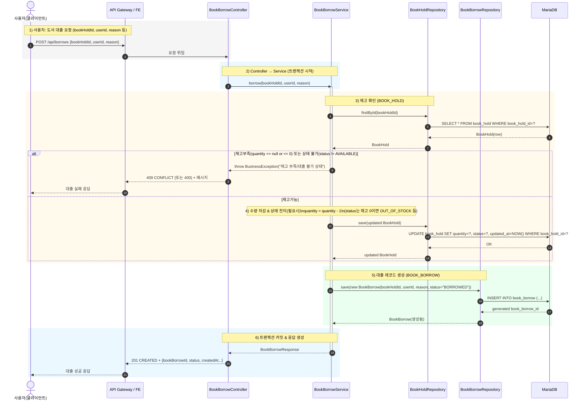

```mermaid
sequenceDiagram
    autonumber
    actor U as 사용자(클라이언트)
    participant API as API Gateway / FE
    participant C as BookBorrowController
    participant S as BookBorrowService
    participant HR as BookHoldRepository
    participant BR as BookBorrowRepository
    participant DB as MariaDB

    rect rgb(245,245,245)
        note over U,API: 1) 사용자: 도서 대출 요청 (bookHoldId, userId, reason 등)
        U->>API: POST /api/borrows {bookHoldId, userId, reason}
        API->>C: 요청 위임
    end

    rect rgb(235,248,255)
        note over C,S: 2) Controller → Service (트랜잭션 시작)
        C->>S: borrow(bookHoldId, userId, reason)
        activate S
    end

    rect rgb(255,250,235)
        note over S,HR: 3) 재고 확인 (BOOK_HOLD)
        S->>HR: findById(bookHoldId)
        HR->>DB: SELECT * FROM book_hold WHERE book_hold_id=?
        DB-->>HR: BookHold(row)
        HR-->>S: BookHold
        alt 재고부족(quantity == null or <= 0) 또는 상태 불가(status != AVAILABLE)
            S-->>C: throw BusinessException("재고 부족/대출 불가 상태")
            C-->>API: 409 CONFLICT (또는 400) + 메시지
            API-->>U: 대출 실패 응답
        else 재고가능
            note over S: 4) 수량 차감 & 상태 전이(필요시)\nquantity = quantity - 1\n(status는 재고 0이면 OUT_OF_STOCK 등)
            S->>HR: save(updated BookHold)
            HR->>DB: UPDATE book_hold SET quantity=?, status=?, updated_at=NOW() WHERE book_hold_id=?
            DB-->>HR: OK
            HR-->>S: updated BookHold
        end
    end

    rect rgb(235,255,240)
        note over S,BR: 5) 대출 레코드 생성 (BOOK_BORROW)
        S->>BR: save(new BookBorrow(bookHoldId, userId, reason, status="BORROWED"))
        BR->>DB: INSERT INTO book_borrow (...)
        DB-->>BR: generated book_borrow_id
        BR-->>S: BookBorrow(생성됨)
    end

    rect rgb(235,248,255)
        note over S,C: 6) 트랜잭션 커밋 & 응답 생성
        S-->>C: BookBorrowResponse
        deactivate S
        C-->>API: 201 CREATED + {bookBorrowId, status, createdAt...}
        API-->>U: 대출 성공 응답
    end

```