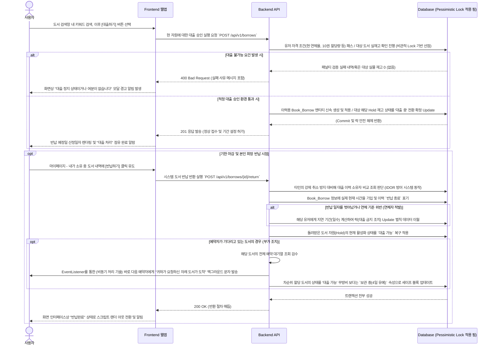

# 도서 검색 및 대출/반납 시퀀스 다이어그램 (Borrow & Return Sequence Diagram)

재고(Hold)가 남아 있는 책을 조회한 뒤, 선점하여 빌리고 시간이 경과 한 뒤 반납하여 다음 차순위자에게 스위칭 시켜주는 핵심 도서 라이프 사이클입니다.

```mermaid
sequenceDiagram
    actor User as 사용자
    participant Client as Frontend 웹앱
    participant Server as Backend API
    participant DB as Database (Pessimistic Lock 적용 됨)

    %% 1. 도서 확보 및 대출 프로세스
    User->>Client: 도서 검색창 내 키워드 검색, 이후 [대출하기] 버튼 선택
    Client->>Server: 현 자원에 대한 대출 승인 실행 요청 `POST /api/v1/borrows`
    Server->>DB: 유저 자격 조건(현 연체율, 10권 할당량 등) 패스 / 대상 도서 실재고 확인 진행 (비관적 Lock 기반 선점)
    
    alt 대출 불가능 요건 발생 시
        DB-->>Server: 패널티 검증 실패 내역/혹은 대상 실물 재고 0 (없음)
        Server-->>Client: 400 Bad Request (실패 사유 메시지 포함)
        Client-->>User: 화면상 "대출 정지 상태이거나 여분이 없습니다" 모달 경고 알림 발생
    else 적정 대출 승인 환경 통과 시
        Server->>DB: 이력용 Book_Borrow 엔티티 신속 생성 및 적용 / 대상 해당 Hold 재고 상태를 '대출 중' 전환 확정 Update
        DB-->>Server: (Commit 및 락 안전 해제 반환)
        Server-->>Client: 201 응답 발송 (정상 접수 및 기간 설정 허가)
        Client-->>User: 반납 예정일 산정일자 렌더링 및 "대출 처리" 점유 완료 알람
    end

    %% 2. 반납 혹은 해지 반환 프로세스
    opt 기한 마감 및 본인 희망 반납 시점
        User->>Client: 마이페이지 - 내가 소유 중 도서 내역에 [반납하기] 클릭 유도
        Client->>Server: 시스템 도서 반납 반환 실행 `POST /api/v1/borrows/{id}/return`
        Server->>DB: 타인의 강제 취소 방지 대비해 대출 이력 소유자 비교 조회 판단 (IDOR 방어 시스템 동작)
        Server->>DB: Book_Borrow 정보에 실제 현재 시간을 기입 및 이력 `반납 종료` 표기
        
        alt 반납 일자를 벗어났거나 연체 기준 위반 (연체자 적발)
            Server->>DB: 해당 유저에게 지연 기간(일수) 계산하여 락(대출 금지 조치) Update 벌칙 데이터 이월
        end

        Server->>DB: 돌려받은 도서 자원(Hold)의 현재 활성화 상태를 `대출 가능` 복구 적용
        
        opt 예약자가 기다리고 있는 도서의 경우 (부가 조치)
            Server->>Server: 해당 도서의 전체 예약 대기열 조회 검수
            Server->>User: EventListener를 통한 (비동기 처리 기술) 바로 다음 예약자에게 "귀하가 요청하신 차례 도서가 도착" 백그라운드 문자 발송
            Server->>DB: 차순위 할당 도서의 상태를 '대출 가능' 무방비 보다는 `보관 중(4일 유예)` 속성으로 세이프 블록 업데이트
        end

        DB-->>Server: 트랜잭션 전부 성공
        Server-->>Client: 200 OK (반환 절차 매듭)
        Client-->>User: 화면 인터페이스상 "반납완료" 상태로 스크립트 랜더 아웃 전환 및 알림
    end
```
