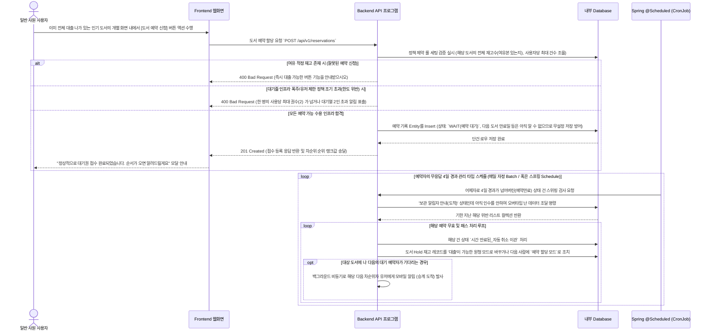

# 도서 예약 대기 시퀀스 다이어그램 (Reservation Sequence Diagram)

회사 내 남은 수량이 없어서 모두 타인이 보관하고 있는 책(재고 0권)에 대하여 대기표를 먼저 선점하는 시퀀스와 그 만료 자동화 구조입니다.

```mermaid
sequenceDiagram
    actor User as 일반 사원 사용자
    participant Client as Frontend 웹화면
    participant Server as Backend API 프로그램
    participant DB as 내부 Database

    %% 1. 도서 소작 대기 예약 진입 플로우
    User->>Client: 이미 전체 대출 나가 있는 인기 도서의 개별 화면 내에서 [도서 예약 신청] 버튼 액션 수행
    Client->>Server: 도서 예약 할당 요청 `POST /api/v1/reservations`
    Server->>DB: 정책 제약 룰 세팅 검증 실시 (해당 도서의 전체 재고수(여유본 있는지), 사용자당 최대 건수 조율)
    
    alt 여유 적정 재고 존재 시 (잘못된 예약 신청)
        Server-->>Client: 400 Bad Request (즉시 대출 가능한 버튼 기능을 안내받으시오)
    else 대기줄 인프라 폭주/유저 제한 정책 조기 초과(한도 위반) 시
        Server-->>Client: 400 Bad Request (한 명의 사용당 최대 권수(2) 가 넘거나 대기열 2인 초과 알림 표출)
    else 모든 예약 가능 수용 인프라 합격
        Server->>DB: 예약 기록 Entity를 Insert (상태: `WAIT(예약 대기)`, 다음 도서 만료일 등은 아직 알 수 없으므로 무설정 저장 방어)
        DB-->>Server: 단건 로우 저장 완료
        Server-->>Client: 201 Created (접수 등록 응답 반환 및 차순위 순위 랭크값 송달)
        Client-->>User: "정상적으로 대기권 접수 완료되었습니다. 순서가 오면 알려드릴게요" 모달 안내
    end

    %% 2. 배치성 시스템 관리(Schedule) 를 활용한 4일 만료 방어 (백그라운드 스레드)
    loop 예약자의 무응답 4일 경과 관리 타임 스케줄 (매일 자정 Batch / 혹은 스프링 Schedule)
        participant Scheduler as Spring @Scheduled (CronJob)
        Scheduler->>Server: 어제자로 4일 경과가 넘어버린(예약만료) 상태 건 스위핑 검사 요청
        Server->>DB: '보관 알림자 안내(도착)' 상태인데 아직 인수를 안하여 오버타임 난 데이터 조달 명령
        DB-->>Server: 기한 지난 해당 위반 리스트 컬렉션 반환
        
        loop 해당 예약 무효 및 패스 처리 루프
            Server->>DB: 해당 건 상태 `시간 만료된_자동 취소 이관` 처리
            Server->>DB: 도서 Hold 재고 레코드를 '대출'이 가능한 원형 모드로 바꾸거나 다음 사람에 `예약 할당 모드`로 조치
            opt 대상 도서에 나 다음의 대기 예약자가 기다리는 경우
                Server->>Server: 백그라운드 비동기로 해당 다음 차순위자 유저에게 모바일 알림 (승계 도착) 발사
            end
        end
    end
```
