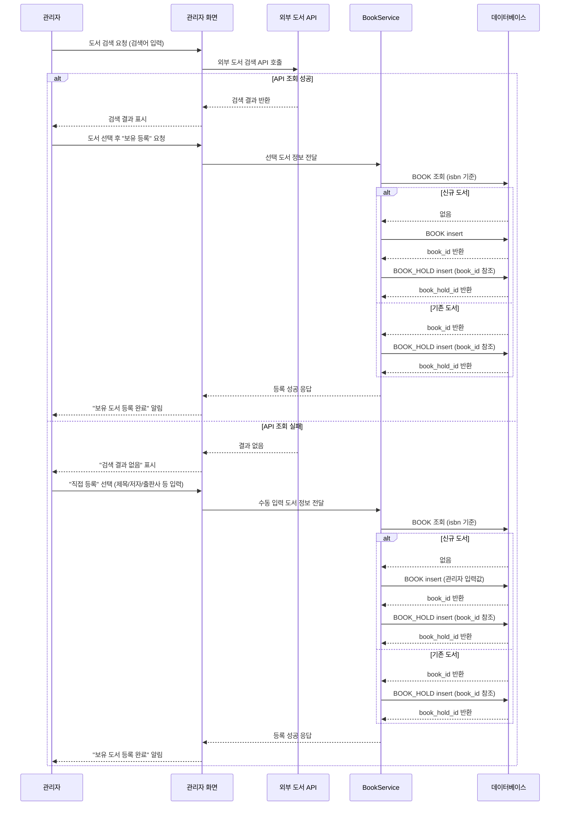

```mermaid
sequenceDiagram
    participant Admin as 관리자
    participant UI as 관리자 화면
    participant API as 외부 도서 API
    participant Svc as BookService
    participant DB as 데이터베이스

    Admin ->> UI: 도서 검색 요청 (검색어 입력)
    UI ->> API: 외부 도서 검색 API 호출
    alt API 조회 성공
        API -->> UI: 검색 결과 반환
        UI -->> Admin: 검색 결과 표시

        Admin ->> UI: 도서 선택 후 "보유 등록" 요청
        UI ->> Svc: 선택 도서 정보 전달
        Svc ->> DB: BOOK 조회 (isbn 기준)
        alt 신규 도서
            DB -->> Svc: 없음
            Svc ->> DB: BOOK insert
            DB -->> Svc: book_id 반환
            Svc ->> DB: BOOK_HOLD insert (book_id 참조)
            DB -->> Svc: book_hold_id 반환
        else 기존 도서
            DB -->> Svc: book_id 반환
            Svc ->> DB: BOOK_HOLD insert (book_id 참조)
            DB -->> Svc: book_hold_id 반환
        end
        Svc -->> UI: 등록 성공 응답
        UI -->> Admin: "보유 도서 등록 완료" 알림

    else API 조회 실패
        API -->> UI: 결과 없음
        UI -->> Admin: "검색 결과 없음" 표시

        Admin ->> UI: "직접 등록" 선택 (제목/저자/출판사 등 입력)
        UI ->> Svc: 수동 입력 도서 정보 전달
        Svc ->> DB: BOOK 조회 (isbn 기준)
        alt 신규 도서
            DB -->> Svc: 없음
            Svc ->> DB: BOOK insert (관리자 입력값)
            DB -->> Svc: book_id 반환
            Svc ->> DB: BOOK_HOLD insert (book_id 참조)
            DB -->> Svc: book_hold_id 반환
        else 기존 도서
            DB -->> Svc: book_id 반환
            Svc ->> DB: BOOK_HOLD insert (book_id 참조)
            DB -->> Svc: book_hold_id 반환
        end
        Svc -->> UI: 등록 성공 응답
        UI -->> Admin: "보유 도서 등록 완료" 알림
    end

```