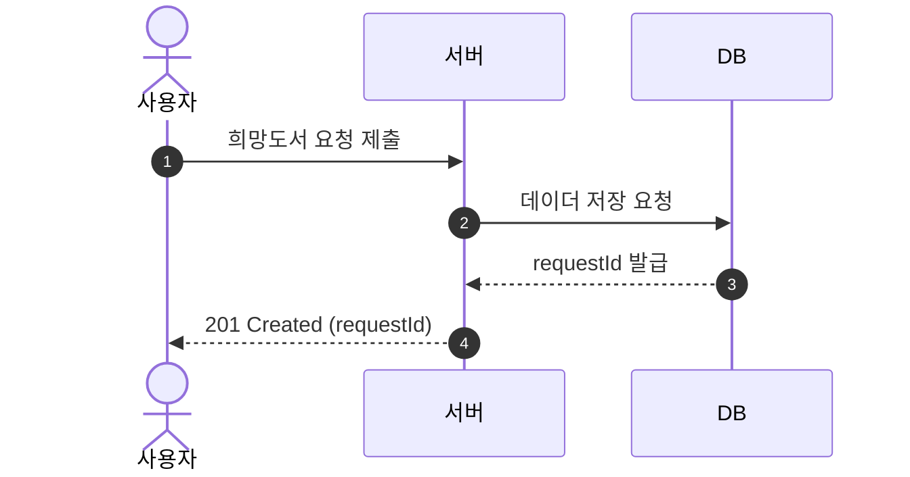
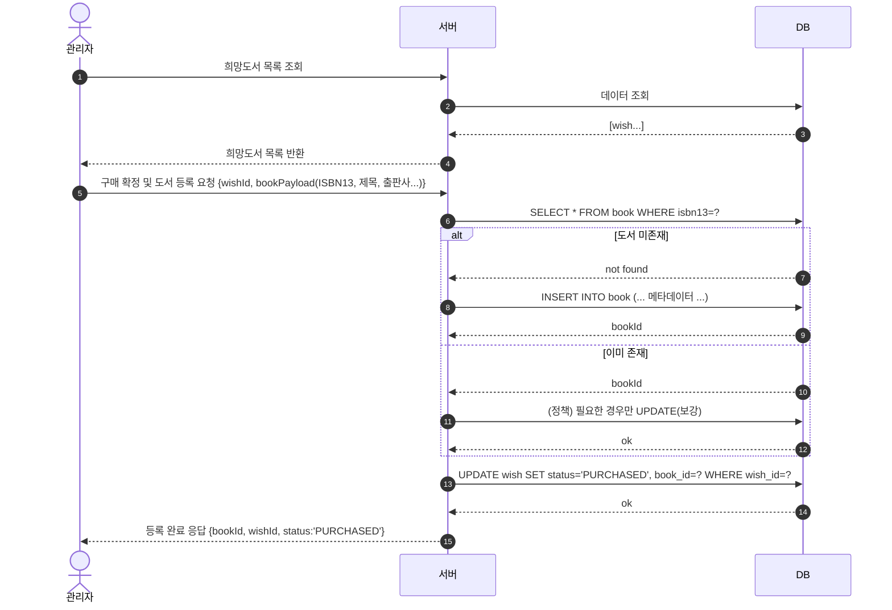

## 카카오 도서 검색 후 사용자 희망 도서 신청 흐름

```mermaid
sequenceDiagram
  autonumber
  actor U as 사용자
  participant S as 서버
  participant D as DB

  U->>S: 희망도서 요청 제출
  S->>D: 데이더 저장 요청
  D-->>S: requestId 발급
  S-->>U: 201 Created (requestId)

```

## 관리자 희망 도서 구매 후 도서 등록 흐름

```mermaid
sequenceDiagram
    autonumber
    actor U as 관리자
    participant S as 서버
    participant D as DB

%% 1) 희망도서 목록 확인
    U->>S: 희망도서 목록 조회
    S->>D: 데이터 조회 
    D-->>S: [wish...]
    S-->>U: 희망도서 목록 반환

%% 2) 구매 확정 + 도서 등록 요청
    U->>S: 구매 확정 및 도서 등록 요청 {wishId, bookPayload(ISBN13, 제목, 출판사...)}
    S->>D: SELECT * FROM book WHERE isbn13=?
    alt 도서 미존재
        D-->>S: not found
        S->>D: INSERT INTO book (... 메타데이터 ...)
        D-->>S: bookId
    else 이미 존재
        D-->>S: bookId
        S->>D: (정책) 필요한 경우만 UPDATE(보강)
        D-->>S: ok
    end

%% 3) 희망도서 상태 갱신(구매 완료 + 연결)
    S->>D: UPDATE wish SET status='PURCHASED', book_id=? WHERE wish_id=?
    D-->>S: ok
    S-->>U: 등록 완료 응답 {bookId, wishId, status:'PURCHASED'}


```